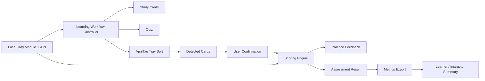
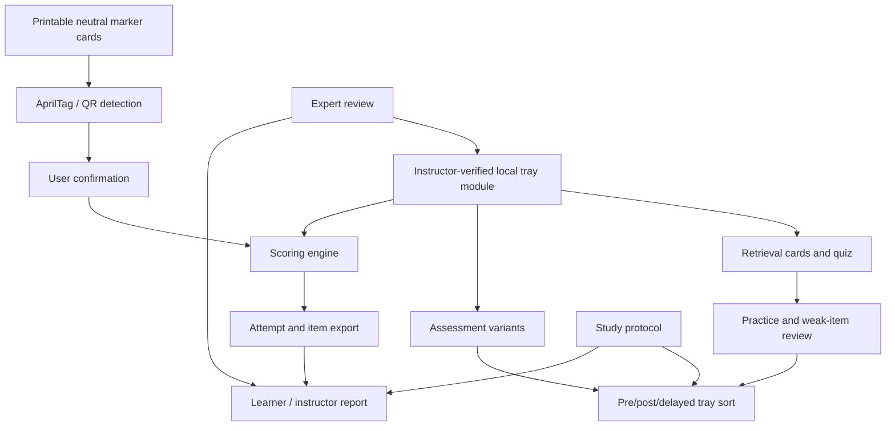

# Final Paper FDR

## Abstract / Executive Summary

TODO: Write this section last after the body of the report is complete. It
should summarize the final problem, the selected TrayGuard direction, the
strongest evidence, the main design decisions, the current limitations, and the
recommended future validation path.

## 1. Introduction And Project Overview

TODO: Write this section after the main body is stable. It should briefly
explain the sterile-processing context, the project pivot toward an
education-centered training and assessment system, and the purpose of this FDR
as a literature-grounded design and risk-reduction handoff for a future team.

## 2. Problem Definition And Scope

### 2.1 Precise Problem Statement

In sterile processing
departments (SPDs), technicians receive used instruments from the OR, clean and
decontaminate them, inspect each item for soil or damage, check function,
assemble procedure-specific trays from count sheets, package trays for
sterilization, run sterilization, store sterile sets, and distribute
them back for surgical use. This work is detailed, high-volume, and highly
local: a technician must know the hospital's instrument names, tray lists,
surgeon preferences, replacement rules, and inspection expectations.

Mistakes can occur at several points in that workflow. A technician may miss
residual soil, overlook a crack or broken tip, confuse two visually similar
instruments, place the wrong size or pattern into a tray, omit an instrument,
add an extra instrument, assemble a device incorrectly, use the wrong count
sheet, package a set incompletely, or fail to catch a sterilization or
documentation problem. In the OR, those mistakes appear as missing, wrong,
extra, damaged, contaminated, nonfunctional, incorrectly assembled, or otherwise
unavailable instruments.

Published rates vary by hospital, measurement method, and error definition, but
the available evidence suggests that these are recurring operational failures,
not isolated accidents. Alfred et al. analyzed 3,900 tray defects across 41,799
cases, or roughly 9 defects per 100 cases, and found that 55.0% of recorded
defects occurred during assembly
([Alfred et al., 2021](bibliography.md#alfred-et-al-2021)). Zhu et al. found
398 packaging errors among 33,839 surgical instrument packages, or about 1.2%
of packages, including wrong specifications, incomplete packages, and missing
instruments ([Zhu et al., 2019](bibliography.md#zhu-et-al-2019)). Nichol et al.
observed 236 surgical instrument errors affecting 147 cases, with most errors
tied to visualization work such as inspection, identification, function
checking, and tray assembly
([Nichol et al., 2024](bibliography.md#nichol-et-al-2024)).

The general problem is therefore:

> Sterile processing workflows do not always reliably produce complete,
> correct, functional, sterile, and ready-for-use surgical instrument sets.


### 2.2 Practice Context

The problem appears across the reusable stainless surgical instrument chain. A simplified
SPD-to-OR cycle includes the following stages
([George et al., 2024](bibliography.md#george-et-al-2024)):

1. Point-of-use preparation: at the end of a procedure, instruments are
   prepared for transfer from the OR to sterile processing. This can include
   gross cleaning, use of sterile water, and enzymatic pretreatment to keep
   material from drying on instruments.

2. Transport to sterile processing: used instruments are moved from the OR or
   procedural area to the sterile processing unit.

3. Decontamination: instruments are cleaned and decontaminated. George et al.
   describe manual scrubbing, ultrasonic cleaning, and automated washer systems
   as common parts of this stage.

4. Assembly and inspection: after decontamination, instruments move to the
   assembly area. Technicians inspect instruments, assemble instrument pans or
   sets, replace missing items, and place instruments into containers or wraps
   for sterilization.

5. Sterilization: packaged instruments are sterilized using methods appropriate
   to the device and material. George et al. describe high-temperature methods
   such as autoclave sterilization and low-temperature methods such as chemical
   or radiation-based sterilization.

6. Storage: once sterilized, instruments and trays are cooled as needed and
   placed in storage until they are required again.

7. Return to use: when needed for surgery, stored instruments are obtained and
   brought back to the OR for the next case.

Nichol and Saari's risk model provides a more detailed version of this cycle:
for simple instruments, they mapped 104 human tasks and found that 91% of
modeled error risk occurred during the sterile-processing portion of the cycle,
especially the decontamination and assembly-and-inspection steps
([Nichol and Saari, 2023b](bibliography.md#nichol-and-saari-risk-modeling-2023)).
Those steps are high risk because they contain the most complicated,
non-routine tasks: instruments must be separated, cleaned, inspected for
bioburden and damage, identified, sorted, and rebuilt into the correct tray, and
all eight highest-risk tasks in the model involved human visualization,
inspection, identification, or sorting.

### 2.3 Narrowed Problem

Within the full SPD-to-OR cycle, this project narrows to tray reconstruction
and verification: the point where cleaned instruments are inspected,
identified, matched to count sheets, and rebuilt into procedure-specific trays.
This is the most defensible focus because the highest-risk parts of the cycle
depend on human visualization, sorting, and local tray knowledge.

This focus also addresses a likely stakeholder objection. Even if a tray comes
from a specific surgery and is expected to return with the same contents, it
does not remain a sealed, unchanged kit during reprocessing. Instruments are
transported to decontamination, opened, separated, disassembled when required,
manually cleaned or transferred onto washer racks, and exposed to mechanical
washing before moving to the clean preparation area
([STERIS, accessed 2026](bibliography.md#steris-cleaning-instruments-accessed-2026),
[CDC](bibliography.md#cdc),
[Public Health Ontario, 2013](bibliography.md#public-health-ontario-2013),
[Medline, 2026](bibliography.md#medline-transport-2026)). After cleaning,
technicians manually rebuild sets against tray-specific count sheets, creating
opportunities for items to be mixed between sets, left behind, substituted from
backup inventory, or misidentified because of incomplete count-sheet data,
local jargon, or look-alike instruments
([Purdue University, accessed 2026](bibliography.md#purdue-count-sheets-accessed-2026),
[Alfred et al., 2021](bibliography.md#alfred-et-al-2021),
[Nadeau, 2024](bibliography.md#nadeau-2024)).

Observed error studies support this narrowed focus. Nichol et al. found that
the largest observed error category was Missing+, which included missing,
wrong, and extra instruments, and connected many errors to visualization work
such as inspection, identification, and function checks
([Nichol et al., 2024](bibliography.md#nichol-et-al-2024)). Alfred et al. found
missing instruments to be the most commonly reported assembly defect and linked
tray defects to OR delays, training, production pressure, inventory,
nomenclature, technology, and workspace constraints
([Alfred et al., 2021](bibliography.md#alfred-et-al-2021)). Zhu et al. found
packaging errors such as wrong instrument specifications, incomplete packages,
and missing instruments in a hospital surgical-instrument tracking system
([Zhu et al., 2019](bibliography.md#zhu-et-al-2019)).

### 2.4 Stakeholders And Importance

Instrument readiness matters because surgery is time-sensitive,
coordination-heavy work. When an instrument set is wrong, incomplete, unclean,
damaged, or unavailable, the OR team may need to pause, search for replacement
instruments, open backup trays, change the procedure flow, or delay the case
([Nichol et al., 2024](bibliography.md#nichol-et-al-2024),
[Pennsylvania Patient Safety Authority, 2006](bibliography.md#pennsylvania-patient-safety-authority-2006)).

Dirty or damaged instruments add a direct safety concern. A 2024 hospital
inspection reported pitting, stains, sticky residue, rust, scratches, and other
concerns in randomly selected ready-for-use trays
([Association of Health Care Journalists, 2024](bibliography.md#association-of-health-care-journalists-2024)).
The Pennsylvania Patient Safety Authority warns that contaminated instruments
can put patients at risk of surgical site infection and can also cause lost OR
time if discovered after a procedure has begun
([Pennsylvania Patient Safety Authority, 2006](bibliography.md#pennsylvania-patient-safety-authority-2006)).

The stakeholders include:

- Patients, who depend on sterile, functional instruments during surgery.
- Surgeons and OR teams, who need complete and usable sets to maintain
  procedure flow.
- SPD technicians, who perform detailed, high-volume work under production
  pressure.
- SPD supervisors and educators, who manage training, quality assurance,
  staffing, documentation, and feedback loops.
- Hospitals, which lose time and capacity when instrument issues delay cases or
  require rework.

### 2.5 General Interest Beyond One Local Practice

This problem is broadly relevant because reusable surgical instruments, SPDs,
procedure-specific trays, count sheets, sterilization records, and OR
dependence on prepared sets are common across hospitals. The exact instruments,
tray lists, vendor systems, and surgeon preferences vary by site, while the
readiness challenge repeats across settings: hospitals must transform complex,
locally defined instrument requirements into complete and ready surgical sets.

The local tray-reconstruction problem connects to broader work on surgical
tray optimization, inventory visibility, and instrument-set readiness. dos
Santos et al. describe tray rationalization as deciding which instruments and
quantities belong in which trays and which trays are needed for procedures
([dos Santos et al., 2021](bibliography.md#dos-santos-et-al-2021)). A 2025
industry benchmark report summarized by Healthcare Purchasing News found that
58% of surveyed SPD and OR leaders reported surgery delays caused by instrument
sets that were missing, incomplete, or not ready on time
([HPN, 2025](bibliography.md#hpn-2025)).
The same benchmark report emphasized human error, inventory gaps, limited data
visibility, and real-time visibility into tray and instrument location as major
readiness concerns
([Aesculap and Ascendco Health, 2025](bibliography.md#aesculap-and-ascendco-health-2025)).

This makes the problem generalizable without making it generic: each hospital
has its own instruments and tray rules, but many hospitals face the same
underlying need to verify that a locally defined set is complete, correct,
clean, functional, and available before surgery.

## 3. Root Cause Analysis

We have already narrowed the problem to a specific point in the sterile
processing workflow. The fishbone head for the RCA is therefore:

> Tray content errors during tray reconstruction.

This effect includes missing instruments, wrong instruments, extra instruments,
wrong quantities, visible damage or function problems, and item selections that
conflict with the count sheet or local tray rule
([Alfred et al., 2021](bibliography.md#alfred-et-al-2021);
[Nichol et al., 2024](bibliography.md#nichol-et-al-2024);
[Zhu et al., 2019](bibliography.md#zhu-et-al-2019)).

### 3.1 Product

| Observed failure mode | Root cause hypothesis |
| --- | --- |
| Wrong instruments appear in trays, and wrong-instrument errors are often similar in type to the intended instrument ([Nichol et al., 2024](bibliography.md#nichol-et-al-2024)). | Same-family variants and look-alike instruments create a discrimination burden that generic instrument familiarity does not solve; users need practice distinguishing local variants by visible features, size, function, and tray context ([Nichol et al., 2024](bibliography.md#nichol-et-al-2024); [Alfred et al., 2021](bibliography.md#alfred-et-al-2021)). |
| Assembly defects include missing, wrong, damaged, incorrectly assembled, and extra instruments ([Alfred et al., 2021](bibliography.md#alfred-et-al-2021)). | Tray composition, instrument design, inventory, and unstandardized nomenclature make the tray itself a complex product to reconstruct reliably ([Alfred et al., 2021](bibliography.md#alfred-et-al-2021)). |
| Procedure-, surgeon-, and tray-specific decisions determine which instruments and quantities belong in a set ([dos Santos et al., 2021](bibliography.md#dos-santos-et-al-2021); [Ahmadi et al., 2023](bibliography.md#ahmadi-et-al-2023)). | Tray contents are local design decisions rather than fixed universal lists, so a user can know instrument families and still select the wrong item or quantity for a specific tray ([dos Santos et al., 2021](bibliography.md#dos-santos-et-al-2021); [Ahmadi et al., 2023](bibliography.md#ahmadi-et-al-2023)). |
| Damaged, malfunctioning, contaminated, or otherwise unacceptable instruments can create readiness and safety concerns ([Alfred et al., 2021](bibliography.md#alfred-et-al-2021); [Nichol et al., 2024](bibliography.md#nichol-et-al-2024); [Pennsylvania Patient Safety Authority, 2006](bibliography.md#pennsylvania-patient-safety-authority-2006)). | Reconstruction must include rejection of visibly unacceptable items, not only selection of named items; otherwise damaged or suspect instruments can remain in a tray despite correct identity and count ([CDC](bibliography.md#cdc); [Pennsylvania Patient Safety Authority, 2006](bibliography.md#pennsylvania-patient-safety-authority-2006)). |

### 3.2 Knowledge

| Observed failure mode | Root cause hypothesis |
| --- | --- |
| Instrument identification, inspection, names, uses, and testing points are explicit sterile-processing learning needs ([HSPA Surgical Instrument Resources, accessed 2026](bibliography.md#hspa-instrument-resources-accessed-2026)). | Users may not have enough retrievable instrument knowledge to identify items, notice damage, or distinguish similar tools during reconstruction ([HSPA Surgical Instrument Resources, accessed 2026](bibliography.md#hspa-instrument-resources-accessed-2026)). |
| Tray assembly requires local names, aliases, quantities, placement rules, and count-sheet use ([Nadeau, 2024](bibliography.md#nadeau-2024)). | General instrument knowledge is insufficient when the task depends on local tray rules; learners need practice applying the exact tray rule, not just recognizing instruments in isolation ([Nadeau, 2024](bibliography.md#nadeau-2024)). |
| Alfred et al. identify technician knowledge, training variation, missing or incorrect photos, and varied names as assembly work-system factors ([Alfred et al., 2021](bibliography.md#alfred-et-al-2021)). | Local knowledge may be inconsistent across staff or training materials, so the same tray can be reconstructed differently depending on who learned which names, photos, and informal rules ([Alfred et al., 2021](bibliography.md#alfred-et-al-2021)). |
| HSPA requires 400 hands-on hours for CRCST certification, including 120 hours in preparation and packaging ([HSPA CRCST, accessed 2026](bibliography.md#hspa-crcst-accessed-2026)). | Tray reconstruction competency depends on repeated hands-on practice; without measured practice, a learner may appear familiar with instruments but still fail under tray-like conditions ([HSPA CRCST, accessed 2026](bibliography.md#hspa-crcst-accessed-2026); [Ofstead et al., 2023](bibliography.md#ofstead-et-al-2023)). |
| AORN describes hands-on and simulation training for decontaminating sets, assembling and wrapping trays, and preparing items for sterilization, while sterile-processing certification commentary frames certification as a baseline that still requires ongoing competency checks, education, and in-services ([AORN Staff, 2025](bibliography.md#aorn-staffing-shortage-2025); [Kovach, 2012](bibliography.md#kovach-2012)). | The supportable root cause is not individual technician incompetence; it is that certification and initial instruction do not prove local tray-reconstruction competence unless they are paired with repeated local practice, observation, feedback, and current tray information ([Kovach, 2012](bibliography.md#kovach-2012); [Ofstead et al., 2023](bibliography.md#ofstead-et-al-2023)). |

### 3.3 Process

| Observed failure mode | Root cause hypothesis |
| --- | --- |
| Alfred et al. found that 55.0% of recorded tray defects occurred during assembly ([Alfred et al., 2021](bibliography.md#alfred-et-al-2021)). | The assembly step is a high-risk control point because content errors can enter or escape while instruments are being selected, counted, inspected, and arranged ([Alfred et al., 2021](bibliography.md#alfred-et-al-2021)). |
| Nichol et al. found that 88.6% of observed errors involved visualization tasks such as inspection, identification, function checking, and sorting ([Nichol et al., 2024](bibliography.md#nichol-et-al-2024)). | Reconstruction depends heavily on manual visual checking; without task-specific aids or practice, users can miss errors that are visible but visually subtle ([Nichol et al., 2024](bibliography.md#nichol-et-al-2024)). |
| Zhu et al. observed packaging errors including wrong specifications, incomplete packages, and missing instruments ([Zhu et al., 2019](bibliography.md#zhu-et-al-2019)). | Downstream package errors can reflect upstream reconstruction and verification gaps, especially when wrong specifications or missing contents are not caught before packaging ([Zhu et al., 2019](bibliography.md#zhu-et-al-2019)). |
| HPN frames following count sheets and inspecting instruments as core preparation, packing, and assembly practices ([Nadeau, 2024](bibliography.md#nadeau-2024)). | If verification is memory-based, inconsistent, or separated from the count sheet, missing, wrong, extra, damaged, or miscounted items can pass through reconstruction ([Nadeau, 2024](bibliography.md#nadeau-2024)). |

### 3.4 Information

| Observed failure mode | Root cause hypothesis |
| --- | --- |
| Count sheets should include tray names, contents, quantities, sizes, reference numbers, preparation and inspection steps, placement instructions, packaging, indicators, and destination/storage details ([Nadeau, 2024](bibliography.md#nadeau-2024)). | If the local build rule is incomplete, outdated, vague, or hard to use, reconstruction shifts from rule-following to interpretation, increasing the chance of wrong items or quantities ([Nadeau, 2024](bibliography.md#nadeau-2024)). |
| Alfred et al. identify missing or incorrect photos and varied instrument names as assembly-relevant factors ([Alfred et al., 2021](bibliography.md#alfred-et-al-2021)). | If names, aliases, and photos are not aligned with the actual tray, users may match the wrong concept to the physical instrument or fail to recognize a local variant ([Alfred et al., 2021](bibliography.md#alfred-et-al-2021)). |
| Outpatient Surgery Magazine describes tray customization and standardization as reducing variation and time spent identifying instruments, and notes that proper OR and sterile-processing staff training is important for recognizing instruments that need sharpening or repair ([Loria, 2024](bibliography.md#loria-2024)). | Tray information must be maintained as a shared local standard; otherwise staff training, instrument identification, defect recognition, and tray reconstruction all depend on informal memory instead of a reliable local rule ([Loria, 2024](bibliography.md#loria-2024); [Nadeau, 2024](bibliography.md#nadeau-2024)). |
| Tray-focused commercial tools emphasize count sheets, photos, assembly information, and proficiency metrics ([Tray Pacer, accessed 2026](bibliography.md#tray-pacer-accessed-2026); [LayerJot SID, accessed 2026](bibliography.md#layerjot-sid-accessed-2026)). | The practical market for tray tools suggests that structured local tray information is a real operational need, not just a classroom convenience ([Tray Pacer, accessed 2026](bibliography.md#tray-pacer-accessed-2026); [LayerJot SID, accessed 2026](bibliography.md#layerjot-sid-accessed-2026)). |
| Loaner-tray workflows depend on visibility across scheduling, vendor delivery, OR awareness, SPD awareness, IFUs, count sheets, status, location, and pickup ([STERIS, 2021](bibliography.md#steris-loaner-trays-2021)). | When tray status, IFUs, count sheets, or source information are not visible during reconstruction, staff may not have the correct local rule for a non-routine or loaner tray ([STERIS, 2021](bibliography.md#steris-loaner-trays-2021)). |

### 3.5 Environment

| Observed failure mode | Root cause hypothesis |
| --- | --- |
| Alfred et al. identify production pressure and workspace constraints as performance-shaping factors in assembly work ([Alfred et al., 2021](bibliography.md#alfred-et-al-2021)). | Time and workspace pressure can reduce the attention available for visual discrimination, count checking, and escalation, making existing product/process risks more likely to become errors ([Alfred et al., 2021](bibliography.md#alfred-et-al-2021)). |
| AORN describes limited training programs, rising market demand, and high turnover as contributors to a shortage of qualified sterile processing technicians; Medline describes short staffing as increasing overtime, miscommunication, and difficulty maintaining quality; Mácola et al. found wage stagnation, inadequate benefits, and financial stress across a national SPD worker survey ([AORN Staff, 2025](bibliography.md#aorn-staffing-shortage-2025); [Brozak, 2025](bibliography.md#brozak-2025); [Mácola et al., 2025](bibliography.md#macola-et-al-2025)). | Staffing pressure is plausible context, but the evidence does not prove it is the direct root cause of tray content errors; it should be treated as an amplifier that can worsen onboarding burden, training quality, attention, and verification gaps ([Alfred et al., 2021](bibliography.md#alfred-et-al-2021)). |
| A Colorado hospital inspection report, summarized by The Colorado Sun, tied a major SPD backlog to increased staffing requirements after new operating rooms opened without evidence that SPD staffing had increased to match the new demand ([Ingold, 2025](bibliography.md#ingold-2025)). | Capacity mismatch can turn SPD work-system stress into delayed cleaning, reprocessing backlogs, and readiness failures; this supports the importance of staffing and training capacity, but it is broader context rather than direct evidence for tray-reconstruction content errors ([Ingold, 2025](bibliography.md#ingold-2025)). |
| Huang et al. examine training demands related to interruptions in central sterile supply departments ([Huang et al., 2025](bibliography.md#huang-et-al-2025)). | Interruptions can break the continuity of counting, sorting, and inspection, so users may lose place in the tray reconstruction task and miss quantity or identity errors ([Huang et al., 2025](bibliography.md#huang-et-al-2025)). |
| OSHA central sterile guidance discusses workstation, reaching, standing, carts, and height-adjustment concerns for central sterile work ([OSHA Central Sterile Supply, accessed 2026](bibliography.md#osha-central-sterile-supply-accessed-2026)). | Physical layout and ergonomic friction can increase handling and search burden, making a visual, detail-heavy reconstruction task harder to perform consistently ([OSHA Central Sterile Supply, accessed 2026](bibliography.md#osha-central-sterile-supply-accessed-2026)). |

### 3.6 Policy And Feedback

| Observed failure mode | Root cause hypothesis |
| --- | --- |
| HPN emphasizes standardized, clearly written count sheets that are available across shifts ([Nadeau, 2024](bibliography.md#nadeau-2024)). | If no one clearly owns count-sheet standardization and updates, different shifts or learners may use different tray rules, names, or quantities during reconstruction ([Nadeau, 2024](bibliography.md#nadeau-2024)). |
| Chobin states that instrument processing requires coordinated policies, procedures, accountability, education, and documentation ([Chobin, 2019](bibliography.md#chobin-2019)). | Without clear policy and accountability, users may not know when to stop, escalate, substitute, reject, or document uncertain tray-content decisions ([Chobin, 2019](bibliography.md#chobin-2019)). |
| Sterile-processing certification commentary argues that certification creates a common knowledge baseline but cannot guarantee error-free work, and that managers must maintain competency programs and continuing education ([Kovach, 2012](bibliography.md#kovach-2012)). | If competency is treated as a one-time credential instead of a measured, recurring, local skill, repeated tray errors may not become targeted retraining, updated modules, or supervisor coaching ([Kovach, 2012](bibliography.md#kovach-2012)). |
| Nichol et al. describe traditional surgical-instrument error reporting as cumbersome, human-dependent, delayed, incomplete, and difficult to integrate with operational systems ([Nichol et al., 2024](bibliography.md#nichol-et-al-2024)). | If error reporting is delayed or incomplete, repeated missing, wrong, extra, damaged, or quantity errors may not become targeted retraining or tray-rule updates ([Nichol et al., 2024](bibliography.md#nichol-et-al-2024)). |
| Ofstead et al. used competency testing and booster training as part of a structured sterile-processing training intervention ([Ofstead et al., 2023](bibliography.md#ofstead-et-al-2023)). | Without repeated assessment and feedback, local tray reconstruction skill can remain unmeasured, making it hard to identify weak instruments, weak rules, or users who need more practice ([Ofstead et al., 2023](bibliography.md#ofstead-et-al-2023)). |
| Safety reports show that content, contamination, and readiness issues can create patient-safety and lost-time concerns when detected late ([Pennsylvania Patient Safety Authority, 2006](bibliography.md#pennsylvania-patient-safety-authority-2006)). | Escalation and feedback need to happen before the tray is treated as ready; otherwise detected issues may become downstream rework or point-of-use disruption ([Pennsylvania Patient Safety Authority, 2006](bibliography.md#pennsylvania-patient-safety-authority-2006)). |

### 3.7 Consolidated Root Cause Chain

```text
Local tray complexity, similar instruments, and exact count requirements
  -> dependence on local knowledge, count-sheet quality, and visual recognition
  -> manual reconstruction and verification under real work-system conditions
  -> missed, wrong, extra, damaged, or miscounted instruments
  -> tray content errors before the tray is considered ready for use
```


### 3.8 Resulting Solvable Scope

The full readiness problem remains too broad for one final project because it
includes staffing, inventory, cleaning practice, sterilization capacity,
scheduling, tracking systems, and OR-SPD communication. The RCA narrows the
project toward a more actionable training and competency gap: local tray
reconstruction depends on detailed instrument knowledge, count-sheet
interpretation, lookalike discrimination, and repeated feedback, yet those
skills are difficult to practice and measure consistently before supervised
hands-on work.

This scope does not claim to solve the entire SPD staffing shortage or certify
clinical competence. Instead, it focuses on a measurable precursor to
competence: whether a learner can improve at identifying missing, wrong, extra,
damaged, or miscounted instruments in a simulated local tray task. That scope
can be studied without a live hospital deployment by using representative
instrument sets, tray-specific count sheets, distractor items, inspection
criteria, and repeated pre/post tray-building tasks.

The resulting research question is:

> How can a local tray training and assessment system help novice users improve
> their ability to detect missing, wrong, extra, damaged, or miscounted
> instruments before supervised SPD tray-reconstruction work?

## 4. Literature And Related Work

The literature supports the final direction only if the claim is kept narrow.
The evidence is strong that tray readiness problems recur, that many important
errors depend on visual inspection and local tray knowledge, and that
simulation plus retrieval practice can improve health-professions learning.
The evidence is not yet strong enough to claim that a student-built prototype
will reduce hospital tray errors or certify sterile-processing competence.

For that reason, TrayGuard should be evaluated as a training and assessment
system first. Its near-term job is to give novices repeated, measured practice
on a local tray module and to show whether they improve on comparable simulated
tray-sorting tasks. Real-instrument computer vision, clinical workflow
automation, and operational error reduction remain future validation layers.

### 4.1 SPD Error And Tray-Readiness Evidence

Several studies make tray reconstruction a defensible intervention point.
Alfred et al. analyzed 3,900 tray defects across 41,799 surgical cases and
found that 55.0% of recorded defects occurred during assembly. The recorded
defects included missing, wrong, damaged, extra, and incorrectly assembled
instruments ([Alfred et al., 2021](bibliography.md#alfred-et-al-2021)). That
finding matters because assembly is the stage where cleaned instruments are
identified, inspected, counted, and rebuilt into a tray before packaging and
sterilization.

Nichol et al. provide a second, more direct error-pattern argument. They
observed 236 surgical instrument errors affecting 147 cases. Missing+ errors
were the largest category and included missing, wrong, and extra instruments.
They also found that 88.6% of observed errors involved visualization tasks such
as inspection, identification, function checking, and sorting
([Nichol et al., 2024](bibliography.md#nichol-et-al-2024)). When delays
occurred, the average delay was about 10 minutes. This does not prove that a
training app will prevent those delays, but it does show that the target task
is not a cosmetic documentation problem. It is a recurrent readiness problem
with operational consequences.

Packaging and inspection evidence points in the same direction. Zhu et al.
found 398 packaging errors among 33,839 surgical instrument packages, including
wrong specifications, incomplete packages, and missing instruments
([Zhu et al., 2019](bibliography.md#zhu-et-al-2019)). Safety reports also show
that dirty, damaged, or suspect instruments can reach ready-for-use trays and
create patient-safety and lost-time concerns when they are found late
([Pennsylvania Patient Safety Authority, 2006](bibliography.md#pennsylvania-patient-safety-authority-2006);
[Association of Health Care Journalists, 2024](bibliography.md#association-of-health-care-journalists-2024)).

The FDR design implication is that TrayGuard should score the error categories
that actually appear in the literature: missing, wrong, extra, misidentified,
wrong-count, and visibly unacceptable items when that content is included in a
future module. The current prototype should focus on the first five categories
because they can be measured in a controlled card-based tray task.

### 4.2 SPD Training And Competency Context

Sterile-processing training is not just general medical vocabulary. It
requires local instrument recognition, tray assembly, inspection, packaging,
and supervised practice. HSPA's CRCST route requires 400 hours of hands-on
experience, including 120 hours in preparation and packaging
([HSPA CRCST, accessed 2026](bibliography.md#hspa-crcst-accessed-2026)). The
CRCST content outline also includes cleaning, decontamination, preparation,
packaging, sterilization, sterile storage, patient-care equipment, and quality
assurance ([HSPA CRCST Content Outline, 2023](bibliography.md#hspa-crcst-content-outline-2023)).
CBSPD's technician certification is a separate credential route and likewise
does not turn a software score into local workplace competence
([CBSPD Technician Exam, accessed 2026](bibliography.md#cbspd-technician-accessed-2026)).

This boundary is important for the training pivot. TrayGuard should not claim
to replace certification, hands-on hours, preceptor observation, or sign-off.
Its value is earlier and narrower: give learners repeated practice before,
during, or between supervised work, and give educators evidence about weak
instruments, weak tray rules, high-confidence errors, and uncertainty.

The training need is also practical. HSPA maintains surgical-instrument
resources focused on instrument identification, names, uses, inspection, and
testing points
([HSPA Surgical Instrument Resources, accessed 2026](bibliography.md#hspa-instrument-resources-accessed-2026)).
AORN describes hands-on and simulation training as part of sterile-processing
workforce development, while staffing and turnover reports show why supervised
training time is a scarce resource rather than an unlimited input
([AORN Staff, 2025](bibliography.md#aorn-staffing-shortage-2025);
[Brozak, 2025](bibliography.md#brozak-2025);
[Mácola et al., 2025](bibliography.md#macola-et-al-2025)). TrayGuard therefore
fits best as an accessibility and modernization layer for training, not as a
shortcut around clinical supervision.

### 4.3 Local Tray And Count-Sheet Evidence

TrayGuard must be local because tray assembly is local. Count sheets are not
just generic instrument lists. They can include tray names, contents,
quantities, sizes, reference numbers, preparation and inspection steps,
placement instructions, packaging, indicators, destination or storage details,
and sign-off fields ([Nadeau, 2024](bibliography.md#nadeau-2024)). Public
Stryker count sheets show the same practical pattern: tray sections,
descriptions, reference numbers, locations, quantities, check boxes, total
counts, additional items, and hospital signature fields
([Stryker Gamma4 Count Sheet, 2023](bibliography.md#stryker-gamma4-count-sheet-2023);
[Stryker IMN Count Sheet, 2023](bibliography.md#stryker-imn-count-sheet-2023)).

Tray optimization literature reinforces that tray contents are design choices.
dos Santos et al. describe rationalization as deciding which instruments and
quantities belong in trays and which trays are needed for procedures
([dos Santos et al., 2021](bibliography.md#dos-santos-et-al-2021)). Ahmadi et
al. similarly frame tray configuration around procedure-, surgeon-, and
usage-based decisions
([Ahmadi et al., 2023](bibliography.md#ahmadi-et-al-2023)). A learner can
therefore know the difference between a Kelly and a Crile and still make the
wrong decision for a specific hospital tray if the local rule, count, alias, or
substitution policy differs.

The local requirement becomes even stronger for specialty, custom, and loaner
trays. Loaner workflows depend on scheduling, vendor delivery, OR awareness,
SPD awareness, IFUs, count sheets, status, location, and pickup
([STERIS, 2021](bibliography.md#steris-loaner-trays-2021)). Commercial tray
tools also emphasize count sheets, tray photos, assembly information, and
proficiency metrics, which suggests that structured local tray information is a
real operational need
([Tray Pacer, accessed 2026](bibliography.md#tray-pacer-accessed-2026);
[LayerJot SID, accessed 2026](bibliography.md#layerjot-sid-accessed-2026)).

The FDR design consequence is a file-backed module contract. TrayGuard should
store local names, aliases, approved photos, required counts, lookalike pairs,
distractors, assessment variants, and module version. The module must be
instructor-verified before the results are described as content-valid.

### 4.4 Learning Science And Simulation Evidence

The training method is defensible if it is framed as a simulation proxy for
local tray familiarity, not as proof of independent clinical competence. Health
professions education has a strong general precedent for simulation: a broad
review of technology-enhanced simulation found improved knowledge, skills, and
behaviors compared with no intervention, and simulation-based medical education
with deliberate practice has also been shown to outperform traditional clinical
education in meta-analysis
([Cook et al., 2011](bibliography.md#cook-et-al-2011);
[McGaghie et al., 2011](bibliography.md#mcgaghie-et-al-2011)). Earlier medical
simulation guidance identifies feedback, repetitive practice, curriculum
integration, and measurable outcomes as important features of effective
simulation ([Issenberg et al., 2005](bibliography.md#issenberg-et-al-2005)).

For sterile processing specifically, Ofstead et al. provide the closest direct
precedent. Their borescope/endoscope visual-inspection training pilot used a
pre-test, structured teaching, hands-on practice, image-based testing,
confidence/satisfaction measures, workplace homework, and a delayed booster
with certified sterile-processing professionals
([Ofstead et al., 2023](bibliography.md#ofstead-et-al-2023)). Tray assembly is
a different task, but the learning structure maps well: the learner must build
visual familiarity, recognize subtle differences, decide when uncertain, apply
a procedural rule, and improve between a baseline task and a later task.

Retrieval-practice evidence explains why the prototype should ask learners to
produce answers before showing them. Tests can improve long-term retention
relative to restudy, repeated testing improved long-term retention in a
medical-education randomized trial, and reviews support practice testing,
distributed practice, spaced digital education, electronic flashcards, and
actionable feedback in health-professions learning
([Roediger and Karpicke, 2006](bibliography.md#roediger-and-karpicke-2006);
[Larsen et al., 2009](bibliography.md#larsen-et-al-2009);
[Dunlosky et al., 2013](bibliography.md#dunlosky-et-al-2013);
[Martinengo et al., 2024](bibliography.md#martinengo-et-al-2024);
[Barrison et al., 2025](bibliography.md#barrison-et-al-2025);
[Hattie and Timperley, 2007](bibliography.md#hattie-and-timperley-2007)).
This supports retrieval-first cards, quizzes, weak-item repetition, and
error-specific feedback as the instructional core rather than decoration around
the tray task.

The electronic-flashcard evidence is especially relevant to the proposed study
and card modes. Barrison et al.'s 2025 scoping review found that electronic
flashcards are widely used in health-professions education, that the research
base grew rapidly from 2019 to 2024, and that many studies examine utilization
and associated learning outcomes. The review also cautions that development and
delivery methods are less systematically studied
([Barrison et al., 2025](bibliography.md#barrison-et-al-2025)). For TrayGuard,
that means flashcards are a credible medical-learning mechanism, but they
should be designed as one part of a larger tray simulation: short prompts,
single target concepts, local photos or card representations, immediate answer
feedback, spacing or weak-item repetition, and a downstream tray-sort task that
tests application rather than isolated recall.

The proposed AprilTag-card tray is a reasonable physical proxy because it
preserves the target cognitive actions while replacing regulated instruments
with safe, cheap, repeatable tokens. The user still has to read a local tray
list, retrieve which items belong, distinguish distractors and lookalikes, apply
counts, place items into a tray area, and respond to feedback. The marker does
not need to prove that the user can handle real sterile instruments; it needs to
make the simulated choice observable to the app. NeuroVase is a close emerging
design precedent: it uses tangible cue cards with a tablet-based mobile AR
system, structured medical curriculum, pre/post assessment, usability measures,
and a controlled user study for neurovascular anatomy and stroke education
([Jahani et al., 2026 NeuroVase](bibliography.md#jahani-et-al-2026-neurovase)).
QR-code education literature similarly supports low-cost printable codes as an
access layer for healthcare learning, simulation, and training support
([Karia et al., 2019](bibliography.md#karia-et-al-2019)).

Serious tabletop and board-game precedents also support the choice to turn a
healthcare protocol into a bounded physical learning game. Ward et al. designed
and evaluated the PlayDecide patient-safety board game in two acute teaching
hospitals; the intervention used cards and facilitated discussion to teach
junior doctors about safety concerns and reporting, and the authors concluded
that it was valuable for patient-safety education and deep discussion
([Ward et al., 2019](bibliography.md#ward-et-al-2019)). This does not prove
TrayGuard will teach tray assembly, but it supports the broader educational
strategy: abstracted physical artifacts can stand in for clinical objects when
the study measures learning, discussion, decision quality, and protocol use
rather than patient outcomes.

Therefore the FDR claim should be narrow and testable: marker cards are an
acceptable first prototype for measuring novice improvement on simulated local
tray sorting. The follow-on SPD pilot must replace or supplement cards with
local photos, real teaching instruments, educator-reviewed count sheets, and
supervised workplace validation before making clinical-transfer claims.

### 4.5 Computer Vision Feasibility And Boundary Evidence

Computer vision remains technically plausible, but it is no longer the central
FDR proof. Deol et al. show that automated surgical-instrument detection and
counting can work in an experimental proof-of-concept setting
([Deol et al., 2024](bibliography.md#deol-et-al-2024)). Atabuzzaman et al.
show that structured image acquisition can support ultra-fine-grained surgical
instrument classification, and Xin et al. address CSSD-oriented instrument
recognition
([Atabuzzaman et al., 2025](bibliography.md#atabuzzaman-et-al-2025);
[Xin et al., 2024](bibliography.md#xin-et-al-2024)). These papers justify
continued CV work as authoring support, camera-assisted practice, or a future
visual review layer.

They do not remove the validation burden for a hospital tray checker. Real SPD
deployment would need local data, manufacturer and variant coverage, lighting
and glare testing, occlusion handling, open-set behavior, workflow review,
human confirmation, false-alert analysis, cleaning and device-policy review,
and site-specific failure-mode reporting. Kienle et al. show why this boundary
matters: strong in-domain detection can drop when instruments come from
different manufacturers
([Kienle et al., 2025](bibliography.md#kienle-et-al-2025)).

The project's earlier CV pipeline is still useful technical evidence, but it
should be treated as a support layer. The FDR's primary claim should come from
the training loop because that loop can be built, tested, and interpreted
without pretending that deployment-grade instrument recognition has already
been solved.

### 4.6 Market And Comparable Tools

Comparable systems cluster into four groups: tray-management products,
instrument tracking systems, surgical simulation tools, and emerging CV or
robotic research systems. None of them eliminates the need for TrayGuard's
bounded training claim.

| Tool or approach | Target user | Relevant features | Evidence strength | Gap relative to TrayGuard |
| --- | --- | --- | --- | --- |
| Tray Pacer | SPD teams and managers | Count sheets, tray assembly support, photos, productivity and proficiency metrics. | Commercial product evidence. | Supports operations, but public materials do not establish the specific pre/post local tray learning study proposed here ([Tray Pacer, accessed 2026](bibliography.md#tray-pacer-accessed-2026)). |
| LayerJot SID | SPD and surgical instrument teams | Instrument documentation, photos, count sheets, and tray information. | Commercial product evidence. | Strong local-information precedent, but not a demonstrated AprilTag-card novice learning loop ([LayerJot SID, accessed 2026](bibliography.md#layerjot-sid-accessed-2026)). |
| CensiTrac and similar tracking systems | Hospitals, SPD, OR inventory teams | Instrument and tray tracking, traceability, inventory visibility. | Commercial and operational precedent. | Addresses tracking and lifecycle visibility more than low-cost novice simulation and weak-item training ([CensiTrac, accessed 2026](bibliography.md#censitrac-accessed-2026)). |
| Touch Surgery and surgical simulators | Medical trainees and clinicians | Repeated simulation attempts, performance logging, skill practice. | Published evaluation and commercial adoption. | Supports simulation logic, but focuses on surgical procedure skills rather than SPD tray reconstruction ([Tulipan et al., 2019](bibliography.md#tulipan-et-al-2019); [Medtronic Touch Surgery, accessed 2026](bibliography.md#medtronic-touch-surgery-accessed-2026)). |
| NeuroVase-style tangible learning cards | Health-professions learners | Physical cue cards, mobile AR, structured curriculum, pre/post testing, usability measures. | Emerging preprint evidence. | Strong design precedent for tangible medical learning, but not sterile-processing content ([Jahani et al., 2026 NeuroVase](bibliography.md#jahani-et-al-2026-neurovase)). |
| Surgical-instrument CV research | Researchers and future technical teams | Detection, counting, fine-grained classification, instrument-stand recognition. | Published research, usually bounded datasets. | Supports future camera assistance, but not deployment-ready SPD workflow claims ([Deol et al., 2024](bibliography.md#deol-et-al-2024); [Atabuzzaman et al., 2025](bibliography.md#atabuzzaman-et-al-2025); [Kienle et al., 2025](bibliography.md#kienle-et-al-2025)). |
| Autonomous tray assembly research | Robotics researchers and future automation teams | Manipulation, sorting, and assembly concepts. | Early research. | Much higher hardware, sterility, safety, and integration burden than the FDR training loop ([da Silva et al., 2026](bibliography.md#da-silva-et-al-2026)). |

TrayGuard's differentiation is not that no one has count sheets, tracking, or
simulation. Its narrower contribution is a low-cost local training loop that
turns a tray module into retrieval-first study, applied tray sorting, immediate
feedback, no-hints assessment, and exportable pre/post evidence.

## 5. Final Product Concept And Design Rationale

The final TrayGuard direction is a local tray training and assessment platform,
not a deployment-ready clinical tray checker. The selected concept keeps the
original readiness problem but moves the proof point earlier in the workflow:
can a novice learn a local tray module well enough to improve on a comparable
simulated tray-sorting task?

This direction was selected because it is useful, buildable, and testable
within the FDR scope. It still addresses tray reconstruction errors, but it
does so by reducing training and knowledge-transfer risk before claiming that a
camera system can verify real sterile-processing trays.

### 5.1 Final Product Concept

TrayGuard is a local tray training and assessment platform. The core product is
a learner-facing app plus a file-backed tray module that defines the
instruments, aliases, required counts, distractors, lookalike pairs,
distinguishing features, and assessment variants for one local tray.

The first build should use printable AprilTag instrument cards as the physical
simulation layer. Each card represents one instrument or instrument variant.
The app scans the cards on a tabletop or tray area, treats the detected markers
as the learner's tray selection, scores the result against the tray template,
and returns missing, extra, wrong, misidentified, and wrong-count feedback in
practice mode. Pre-test and post-test modes suppress hints and corrective
feedback so the same system can collect baseline and post-training evidence.

The full learning loop is:

```text
local tray module -> pre-test -> retrieval-first cards -> quiz -> AprilTag-card tray sort -> post-test -> metrics export
```

This concept keeps the prototype buildable while preserving the important task
structure: the learner must use local names, local counts, visual/semantic
distinctions, and tray rules to assemble a simulated tray.

### 5.2 Rationale For The Training-Centered Pivot

The project originally aimed at a live CV tray checker: detect instruments,
compare detections against a tray list, and return a readiness result. That
direction remains attractive, but it has the wrong proof burden for the current
FDR. A useful clinical tray checker would need strong evidence across real
instruments, local tray definitions, similar variants, glare, occlusion,
unknown objects, workflow interruptions, false alerts, human review, device
policy, cleaning, privacy, and adoption. The current project can demonstrate
parts of that pipeline, but it cannot responsibly claim deployment-grade
clinical reliability.

The Week 6 pivot made the value proposition more testable: reduce simulated
time-to-competency and training burden for sterile-processing learners by
building an interactive training platform. That direction keeps the same root
problem, because missing, wrong, extra, and misidentified instruments still
arise during tray reconstruction. It changes the claim from "the model can
outperform humans in a hospital environment" to "novices can improve on a
measured local tray simulation after retrieval-centered practice."

This is a better FDR claim for three reasons. First, it matches the evidence:
sterile-processing work depends on local knowledge and supervised practice, and
simulation/retrieval evidence supports repeated practice with feedback. Second,
it is buildable with low-cost materials: a file-backed tray module, printable
cards, a scanning surface, scoring, and export. Third, it reduces risk for a
future CV system by creating validated local content, error categories,
workflow language, and learner data before asking a camera model to make
clinical-grade distinctions.

### 5.3 Alternatives Considered

Several product directions were considered:

| Alternative | Benefit | Reason rejected or deferred |
| --- | --- | --- |
| Deployment-grade CV tray checker on real instruments | Closest to the original automation concept and strongest if validated in an SPD. | Requires local instrument data, clinical workflow integration, failure-mode validation, and regulatory/adoption work beyond the FDR timeline. |
| Software-only study and quiz module | Fastest implementation path and easiest novice study. | Too far from the tray reconstruction task; it would mostly test recognition, not applied count-sheet use. |
| Real teaching instruments with camera-supported tray review | Better physical fidelity than cards. | Requires access to representative instruments, cleaning/handling rules, storage, and educator review; appropriate for an SPD pilot after the simulated loop works. |
| Printable QR/AprilTag instrument cards | Cheap, portable, repeatable, and compatible with device scanning; closely matches NeuroVase-style tangible cue-card learning. | Less physically realistic than real instruments, so claims must stay limited to simulated tray-task improvement. |
| Manual drag-and-drop tray simulation | Simple software implementation without camera setup. | Does not exercise physical search, placement, or scanning workflow, and is less persuasive for an interactive FDR demo. |

The selected first prototype is the printable AprilTag-card path because it
creates a physical, measurable simulation without depending on deployment-grade
instrument recognition.

### 5.4 Selected Candidate And Backup Paths

The selected candidate is:

> A local tray training and assessment app that uses printable AprilTag
> instrument cards for simulated tray sorting, retrieval-first study, quiz,
> practice feedback, no-hints pre/post assessment, and metrics export.

The backup paths are layered so the project still produces evidence if one
piece fails.

| Level | Selected path | Backup path | Claim preserved |
| --- | --- | --- | --- |
| Learning feature | Retrieval cards, quiz, practice sort, pre/post sort. | If the full loop is too long, run pre-test, study cards, practice sort, and post-test only. | Immediate simulated learning. |
| Physical interface | AprilTag cards scanned on a tray mat. | Use QR codes or manual card selection if AprilTag scanning is unreliable. | Local tray-task learning, with marker reliability reported as a limitation. |
| Content | `basic_general_tray_v1` with 8-12 required concepts, distractors, lookalikes, and matched variants. | Reduce to 6-8 required concepts while preserving at least two lookalike pairs and count errors. | Bounded module feasibility. |
| CV | Marker detection only for FDR scoring. | Defer all camera recognition and score user selections manually. | Training evidence without CV overclaim. |
| Evaluation | 8-12 novice participants plus delayed retention if schedule allows. | Run a smaller formative walkthrough and report it as usability/protocol evidence, not learning proof. | Risk-reduction handoff. |
| Content validity | SPD educator or instructor review. | Faculty or surgical-technology reviewer plus explicit future SPD review requirement. | Plausibility review, not clinical validation. |

This backup strategy is intentionally conservative. It protects the FDR from
collapsing into a fragile detector demo and keeps the main deliverable aligned
with the training pivot.

## 6. Requirements Definition

The requirements translate the narrowed problem into a formative learning
claim. They are not hospital deployment requirements. They define what the
prototype must do to support a credible FDR statement about novice improvement
on a simulated local tray task.

### 6.1 Element Definition

| Element | Definition For TrayGuard |
| --- | --- |
| Intended practice | Novice preparation for local tray reconstruction before or alongside supervised SPD training. |
| Other practice affected | Instructor review, preceptor coaching, tray content updates, weak-item remediation, and future CV-supported tray review. |
| Artifact | A local training app, file-backed tray module, printable marker cards, tray-sorting surface, scoring engine, and export/report package. |
| Problem addressed | Learners need repeated, measurable practice applying local tray rules, counts, aliases, and lookalike discrimination before real tray work. |
| Technology | Local web/app workflow, JSON tray modules, QR or AprilTag cards, camera or manual selection input, scoring logic, and CSV/JSON export. |
| Primary users | Novice learners, instructors, SPD educators, and future project teams. |
| Perception goal | The system should feel like a serious practice tool, not a clinical approval device or punitive surveillance system. |
| Environment | Classroom, skills lab, project demo, or supervised training setting; not a live sterile field or production SPD deployment. |
| Core function | Convert a local tray module into study, quiz, simulated sorting, feedback, assessment, and learner metrics. |
| Required behavior | Separate practice from assessment, suppress hints during pre/post modes, classify errors consistently, and export comparable rows. |
| Structure | Content module, learning workflow, marker/manual input, scoring engine, feedback engine, reporting/export, and instructor review. |
| Intended effects | Improve simulated tray-sorting accuracy, reduce severe errors, expose weak items, calibrate confidence, and reduce early preceptor burden. |
| Possible side effects | Overclaiming simulated scores, punitive use of learner metrics, answer leakage, inequitable access to updated modules, and reduced attention to supervised hands-on practice. |

### 6.2 Objective Tree

```text
Improve novice readiness for local tray reconstruction through repeatable,
measurable simulated practice.

1. Increase local tray knowledge
   1.1 Teach local names, aliases, and instrument families
   1.2 Teach required counts and tray-specific rules
   1.3 Teach lookalike and same-family distinctions

2. Improve applied tray-sorting performance
   2.1 Reduce missing required items
   2.2 Reduce wrong and misidentified items
   2.3 Reduce extra and wrong-count items
   2.4 Maintain reasonable task time without rewarding guessing

3. Make learning measurable
   3.1 Capture pre-test and post-test accuracy
   3.2 Export item-level error categories
   3.3 Capture confidence, Not sure choices, and high-confidence errors
   3.4 Preserve comparable assessment variants

4. Support instructors
   4.1 Show weak instruments and weak tray rules
   4.2 Keep modules local, versioned, and reviewable
   4.3 Avoid collecting patient data or unnecessary learner identifiers

5. Preserve claim boundaries
   5.1 Label outputs as simulated practice evidence
   5.2 Require expert review before content-valid claims
   5.3 Require SPD pilot evidence before workplace-effectiveness claims
```

### 6.3 Performance Specifications

The first build should use the following targets. They are deliberately
formative rather than clinical: they define when the prototype is ready to
support an FDR novice-learning claim.

| Area | Target | Evidence Basis | Measurement |
| --- | --- | --- | --- |
| Participant count | Minimum 8 novice participants; target 12 complete participants if schedule allows. | NeuroVase used a 40-participant controlled study for an educational card/AR system, while qualitative methods literature supports small, narrow, homogeneous samples for early formative work ([Jahani et al., 2026 NeuroVase](bibliography.md#jahani-et-al-2026-neurovase); [Malterud et al., 2016](bibliography.md#malterud-et-al-2016); [Hennink and Kaiser, 2022](bibliography.md#hennink-and-kaiser-2022)). | Unique participants with complete pre/post attempts. |
| Completion rate | At least 7 of 8 participants, or 85% when n > 8, complete the full loop without blocking moderator intervention. | Usability must be separated from learning; NeuroVase used SUS and user-experience measures alongside knowledge testing. | Completion flag and blocking help requests. |
| Accuracy gain | Mean paired tray accuracy improves by at least 20 percentage points from pre-test to post-test. | Ofstead's SP training pilot showed large pre/post score movement after structured teaching and hands-on practice; TrayGuard should set a smaller but visible formative threshold ([Ofstead et al., 2023](bibliography.md#ofstead-et-al-2023)). | `post_accuracy - pre_accuracy`. |
| Post-test floor | Mean post-test accuracy is at least 80%, and no more than one participant scores below 70%. | The goal is not only improvement from a low baseline; learners should reach a usable simulated familiarity level before the module is considered ready. | Post-test `accuracy_score`. |
| Severe-error reduction | Mean `missing + wrong + misidentified` errors decrease by at least 30%. | Alfred et al. and Nichol et al. show missing, wrong, extra, and assembly-related errors are operationally meaningful categories ([Alfred et al., 2021](bibliography.md#alfred-et-al-2021); [Nichol et al., 2024](bibliography.md#nichol-et-al-2024)). | Paired error-category counts. |
| Speed without unsafe guessing | Median post-test duration is at least 10% lower, or is no more than 20% higher if accuracy improves by at least 20 points. | Time matters because tray assembly is workflow-bound, but speed alone could reward guessing. | `duration_seconds`, paired by learner. |
| Confidence calibration | High-confidence errors decline by at least 30%; low-confidence correct answers are exported. | Ofstead captured confidence/satisfaction, and feedback research supports showing learners where they are and what to do next ([Ofstead et al., 2023](bibliography.md#ofstead-et-al-2023); [Hattie and Timperley, 2007](bibliography.md#hattie-and-timperley-2007)). | Confidence >= 4 on incorrect items; confidence <= 2 on correct items. |
| Retention | If schedule allows, a 7-14 day delayed tray sort retains at least half of the immediate accuracy gain. | Bell et al. showed immediate medical-learning gains can decay within days and recommended reinforcement after as little as 1 week; same-day results should not be called retention ([Bell et al., 2008](bibliography.md#bell-et-al-2008)). | Delayed `accuracy_score` relative to pre/post. |
| Marker reliability | At least 95% card detection in normal layouts and no systematic marker-ID confusion before user testing. | The marker layer is a measurement tool; if detection fails, scores confound learner error with app error. | Marker bench-test log. |
| Export completeness | Every completed run exports attempt-level and item-level records with required fields. | Instructor-facing evidence is part of the training value proposition. | CSV/JSON schema validation. |
| Demo success | A facilitator can load the module, run pre-test, study, quiz, practice sort, post-test, and export metrics in one uninterrupted demo. | The FDR requires an interactive demonstration of a functional design. | End-to-end checklist. |

### 6.4 Quality Function Deployment

Compact QFD:

| Stakeholder need | Engineering characteristic | Target value | Verification |
| --- | --- | --- | --- |
| Learners can practice local tray content repeatedly. | File-backed module with required items, distractors, aliases, features, counts, and variants. | One complete `basic_general_tray_v1` module with 8-12 required concepts and 3-6 distractors. | Module schema review and demo load. |
| Practice feels connected to tray reconstruction, not isolated memorization. | Simulated tray sort using physical cards or manual selection. | Pre-test, practice, post-test, and optional delayed variant all use the same tray rule. | End-to-end run. |
| Educators can see what learners missed. | Attempt-level and item-level export. | 100% of completed runs export all required fields. | Schema validation. |
| Errors map to operationally meaningful categories. | Scoring engine with `missing`, `extra`, `wrong`, `misidentified`, and `wrong_count`. | Every submitted tray receives category counts. | Unit tests or scored example cases. |
| Assessment is not contaminated by coaching. | Mode boundaries and feedback suppression. | No hints or corrective feedback in pre-test, post-test, or delayed modes. | UI walkthrough and export mode check. |
| The physical marker layer does not corrupt scores. | Marker reliability and user confirmation. | At least 95% detection in normal layouts; confirmation before scoring. | Study 0 marker log. |
| Learner confidence is visible. | Confidence or `Not sure` capture. | High-confidence errors and low-confidence correct answers exported. | Export inspection. |
| The system remains ethical and nonpunitive. | Privacy and report labels. | Hashed learner IDs, no patient data, and report language that says practice evidence. | Report review. |
| Future teams can extend the design. | Versioned data model and traceability. | Module version, source notes, verification status, and assessment variant IDs included. | Data file review. |

### 6.5 Requirement Traceability Matrix

| Req. | Stakeholder need | Design feature | Evidence source | Validation method | Status / owner |
| --- | --- | --- | --- | --- | --- |
| FR-1 Load local module | Educators need updateable local tray rules. | JSON tray module and module selector. | Count-sheet and local tray evidence ([Nadeau, 2024](bibliography.md#nadeau-2024)). | Change module data and reload. | Ready for implementation. |
| FR-2 Retrieval cards | Learners need active recall of names, features, and counts. | Prompt-before-reveal cards. | Retrieval and flashcard evidence ([Roediger and Karpicke, 2006](bibliography.md#roediger-and-karpicke-2006); [Barrison et al., 2025](bibliography.md#barrison-et-al-2025)). | Card walkthrough and quiz logs. | Ready for implementation. |
| FR-3 Pre/post assessment | Reviewers need measurable learning evidence. | No-hints pre-test and post-test variants. | Ofstead pre/post training pattern ([Ofstead et al., 2023](bibliography.md#ofstead-et-al-2023)). | Paired run export. | Protocol-ready. |
| FR-4 Quiz mode | Learners need feedback before applied sorting. | Quiz with confidence and weak-item logging. | Feedback and retrieval evidence ([Hattie and Timperley, 2007](bibliography.md#hattie-and-timperley-2007)). | Quiz result export. | Ready for implementation. |
| FR-5 Practice feedback | Learners need actionable correction. | Error-specific feedback engine. | Tray defect categories ([Alfred et al., 2021](bibliography.md#alfred-et-al-2021); [Nichol et al., 2024](bibliography.md#nichol-et-al-2024)). | Seeded error cases. | Defined. |
| FR-6 Metrics export | Instructors need reviewable evidence. | Attempt and item CSV/JSON. | Error-reporting and competency feedback needs ([Nichol et al., 2024](bibliography.md#nichol-et-al-2024); [Ofstead et al., 2023](bibliography.md#ofstead-et-al-2023)). | Schema validation. | Defined. |
| FR-7 Mode separation | Assessment must remain fair. | Mode state and feedback suppression. | Simulation assessment logic and answer-leakage risk. | UI walkthrough. | Defined. |
| NFR-1 Fast data load | Demo cannot stall. | Local file storage. | Usability expectations. | Load timing <= 2 seconds. | Future test. |
| NFR-2 Short flow | Participants can finish in one session. | Bounded module and timed segments. | Study protocol and sample feasibility. | Pilot timing <= 45-60 minutes for study; <= 20 minutes for demo. | Future test. |
| NFR-3 Export reliability | No completed run should be lost. | Local export after each run. | Study evidence requirement. | 100% completed-run exports. | Future test. |
| NFR-4 Privacy | Learners should not be surveilled unnecessarily. | Hashed IDs and no PHI. | Healthcare data governance concerns. | Export review. | Defined. |
| NFR-5 Content traceability | Local content must be auditable. | Source notes and instructor verification status. | Count-sheet and local-content boundary. | Module review. | Defined. |
| NFR-6 Capability labels | Stakeholders must not overread scores. | Report language: simulated practice evidence. | Certification and clinical-transfer boundaries. | Report review. | Defined. |

## 7. System Design

The selected system is a local, file-backed training app with a physical card
interface. It should be implemented as a buildable learning loop first, with
real-instrument CV reserved for later support work.

### 7.1 System Overview

TrayGuard should be built as a local module runner plus a card-scanning
assessment surface. The app does not need to recognize real instruments for the
first study. It needs to observe which simulated instrument cards the learner
placed in the tray area, score that selection against a local tray template,
and export evidence.

```text
local tray module
  -> pre-test AprilTag tray sort
  -> retrieval-first study cards
  -> quiz with confidence / Not sure
  -> practice AprilTag tray sort with feedback
  -> post-test AprilTag tray sort
  -> metrics export
  -> optional 7-14 day delayed retention sort
```

The architecture follows the evidence base:

- Local tray modules are required because count sheets define tray names,
  contents, quantities, sizes, and reference/catalog numbers, and real count
  sheets include fields such as reference number, description, location, quantity,
  check box, total count, and hospital signature ([Nadeau, 2024](bibliography.md#nadeau-2024);
  [Stryker Gamma4 Count Sheet, 2023](bibliography.md#stryker-gamma4-count-sheet-2023);
  [Stryker IMN Count Sheet, 2023](bibliography.md#stryker-imn-count-sheet-2023)).
- Retrieval-first study and quiz modes are justified by retrieval practice,
  health-professions flashcard evidence, and spaced digital education
  ([Roediger and Karpicke, 2006](bibliography.md#roediger-and-karpicke-2006);
  [Barrison et al., 2025](bibliography.md#barrison-et-al-2025);
  [Martinengo et al., 2024](bibliography.md#martinengo-et-al-2024)).
- Pre/post practice, confidence capture, and optional delayed retention follow
  the sterile-processing precedent in Ofstead and the retention warning in Bell
  et al. ([Ofstead et al., 2023](bibliography.md#ofstead-et-al-2023);
  [Bell et al., 2008](bibliography.md#bell-et-al-2008)).
- AprilTag cards are a physical proxy, not a real-instrument detector. The
  tangible-card idea is supported by NeuroVase-style cue cards and
  board/card-based healthcare education, but clinical transfer remains future
  validation ([Jahani et al., 2026 NeuroVase](bibliography.md#jahani-et-al-2026-neurovase);
  [Ward et al., 2019](bibliography.md#ward-et-al-2019)).

### 7.2 Subsystem Breakdown

The system separates into these functional subsystems:

| Subsystem | Responsibility |
| --- | --- |
| Local content/tray module | Stores instrument records, aliases, photos, distinguishing features, required quantities, distractors, and tray-template versions. |
| Learning workflow | Routes the learner through pre-test, study, quiz, practice sort, weak-item review, post-test, and export. |
| Retrieval practice | Presents prompt-before-answer cards and quizzes for instrument names, features, lookalikes, and required counts. |
| AprilTag card scanning | Detects printed marker cards and maps marker IDs to instrument IDs so the app can observe a physical tray simulation. |
| Simulated tray scoring | Compares detected cards and selected quantities against the tray template. |
| Feedback engine | Reports missing, extra, wrong, misidentified, and wrong-count errors in practice mode. |
| Confidence/uncertainty capture | Records confidence or `Not sure` responses for assessment and instructor review. |
| Reporting/export | Produces pre/post accuracy, time, error-category, confidence, and weak-item summaries. |
| Instructor review | Lets an educator verify tray content, local naming, distractors, and study evidence before broader use. |

Computer vision for recognizing real instruments remains a future support
subsystem. In the FDR build, the marker-scanning subsystem is deliberately a
proxy for observing user decisions, not a claim that the app can identify real
surgical instruments under clinical conditions.

### 7.3 Functional Block Diagram



In practice modes, the scoring engine sends error-specific feedback back to the
learner. In assessment modes, the same engine records errors but suppresses
corrective feedback until after submission.

### 7.4 Dependency Diagram



Highest-risk dependency wires:

| Dependency | Risk | Mitigation |
| --- | --- | --- |
| Expert review -> local tray module | If names, counts, distractors, or feedback are unrealistic, learning results lose content validity. | Require instructor/SPD review before claiming content plausibility. |
| Marker cards -> detection -> scoring | If cards are missed or confused, learner scores mix app error with user error. | Run Study 0, log raw detections, and require user confirmation before scoring. |
| Assessment variants -> pre/post claim | If the post-test is easier or leaks answers, improvement is not credible. | Match required items, counts, distractors, lookalikes, and difficulty across variants. |
| Retrieval/practice -> post-test | If practice only teaches the exact post-test layout, results are memorization. | Use parallel variants and test the same tray rule in a different order/view/distractor mix. |
| Export -> instructor report | If exported rows are incomplete, results cannot support the FDR claim. | Validate schemas before running participants. |
| Student sample -> stakeholder conclusion | Students can test novice learning, but not SPD workplace transfer. | Label Study 1 as simulated novice evidence and reserve SPD claims for later pilot. |

### 7.5 Data Model And Module Contract

The data model should mirror a real count sheet while staying small enough for
the first build. Stryker's public count sheets show the practical minimum:
reference number, description, location/layer, quantity, check box, total count,
additional items, and hospital signature. TrayGuard adds learning-specific
fields for aliases, lookalikes, confidence, and error categories.

| Object | Required Fields | Why It Matters |
| --- | --- | --- |
| `Instrument` | `id`, `display_name`, `family`, `aliases`, `distinguishing_features`, `image_refs`, `apriltag_id`, `local_verification_status` | Supports retrieval cards, quiz prompts, card scanning, and local naming. |
| `TrayTemplate` | `id`, `name`, `version`, `procedure_family`, `source_note`, `required_items`, `distractor_items`, `lookalike_pairs`, `assessment_variants` | Stores the local count-sheet task and separates required instruments from distractors. |
| `TrayItemRequirement` | `instrument_id`, `quantity`, `reference_number`, `location_or_layer`, `acceptable_substitutes`, `notes` | Mirrors real count-sheet fields and makes count/location errors measurable. |
| `AssessmentVariant` | `id`, `mode`, `random_seed`, `required_item_ids`, `distractor_item_ids`, `card_front_policy`, `feedback_enabled` | Keeps pre/post/delayed tasks comparable while preventing answer leakage. |
| `LearningRun` | `run_id`, `learner_id_hash`, `participant_group`, `tray_template_id`, `variant_id`, `mode`, `started_at`, `completed_at` | Separates study, quiz, practice, pre-test, post-test, and delayed attempts. |
| `DetectedCard` | `run_id`, `apriltag_id`, `instrument_id`, `timestamp`, `detection_confidence`, `confirmed_by_user` | Lets marker failures be audited instead of silently counted as learner errors. |
| `AttemptResult` | `run_id`, `selected_items`, `duration_seconds`, `accuracy_score`, `required_recall`, `errors`, `confidence_summary` | Provides the main pre/post evidence. |
| `ItemResult` | `run_id`, `instrument_id`, `required_qty`, `selected_qty`, `error_category`, `confidence`, `not_sure` | Supports item-level feedback, weak-item review, high-confidence error reporting, and instructor review. |

The first implementation can store these objects in JSON files and export CSV
for analysis. The important constraint is schema stability: pre-test, post-test,
and delayed retention must produce comparable rows.

Sample instrument JSON:

```json
{
  "id": "mayo_scissors_straight_55",
  "display_name": "Straight Mayo scissors, 5.5 in",
  "family": "cutting_dissecting",
  "aliases": [
    "straight Mayo",
    "suture scissors"
  ],
  "distinguishing_features": [
    "Heavy straight blades",
    "Broader blade profile than Metzenbaum scissors",
    "Ring-handled cutting instrument"
  ],
  "common_confusions": [
    "mayo_scissors_curved_55",
    "metzenbaum_scissors_curved_55"
  ],
  "image_refs": [
    {
      "id": "view_a",
      "path": "assets/instruments/mayo_scissors_straight_55_view_a.jpg",
      "source": "local_photo",
      "approved_for_study": true,
      "approved_for_assessment": true,
      "attribution": "Local TrayGuard photo"
    },
    {
      "id": "card_front_neutral",
      "path": "assets/cards/mayo_scissors_straight_55_neutral_front.png",
      "source": "generated_card",
      "approved_for_study": false,
      "approved_for_assessment": true,
      "attribution": "TrayGuard AprilTag card"
    }
  ],
  "apriltag_id": 12,
  "card_front_policy": "neutral_assessment_front",
  "study_prompts": [
    {
      "id": "name_recall",
      "prompt": "Name this instrument.",
      "answer": "Straight Mayo scissors, 5.5 in"
    },
    {
      "id": "feature_recall",
      "prompt": "What feature helps distinguish this from Metzenbaum scissors?",
      "answer": "Straight Mayo scissors have heavier, broader blades."
    }
  ],
  "notes": "Use local photos before pilot. Do not rely on vendor images for assessed study content.",
  "local_verification_status": "pending_review"
}
```

### 7.6 Mode Behavior

| Mode | Input | Hints | Feedback | Stored Output |
| --- | --- | --- | --- | --- |
| Pre-test | AprilTag tray sort against count-sheet prompt | No | No | Attempt result, item results, confidence, duration, errors. |
| Study cards | Instrument prompt, photo/card, feature, alias, or count | Yes after reveal | Yes | Optional viewed cards and self-rated confidence. |
| Quiz | Recall or recognition prompt with distractors | Limited after answer | Yes | Correctness, duration, confidence, weak items. |
| Practice sort | AprilTag tray sort with distractors | Yes | Yes | Attempt result plus immediate missing/extra/wrong/misidentified/wrong-count feedback. |
| Post-test | Parallel AprilTag tray sort | No | No | Comparable assessment result. |
| Delayed retention | Third parallel AprilTag tray sort after 7-14 days | No | No | Retention result and decay/recovery summary. |
| Export/report | Completed run data | N/A | N/A | CSV/JSON plus learner summary. |

### 7.7 User Interaction / Experience

Learner workflow:

1. Enter anonymous participant ID.
2. Complete prior-experience questions.
3. Assemble the pre-test tray from neutral AprilTag instrument cards.
4. Confirm detected cards before submission.
5. Study retrieval-first cards and answer quiz prompts.
6. Practice tray sorting with feedback.
7. Complete a no-hints post-test and short survey.
8. Return for delayed retention if scheduled.

Instructor/researcher workflow:

1. Author or load the tray module.
2. Print neutral assessment cards and study/reference cards.
3. Run marker reliability check.
4. Moderate sessions and record help requests.
5. Export pre/post/delayed metrics.
6. Review weak items, high-confidence errors, scan failures, and qualitative
   feedback.
7. Revise module content before future SPD validation.

## 8. Training Module Design

The first module is one evidence-complete local tray curriculum, not a broad
instrument encyclopedia. The module must be small enough to build, test, and
explain in an FDR demo while still exercising the target task: local tray
assembly from a count-sheet-like rule.

The bounded capability claim is:

> TrayGuard gives novices repeated, measured practice on local tray familiarity
> and can test whether that practice improves simulated tray-sorting
> performance.

### 8.1 Module Scope

The first module should contain:

- 8-12 required instrument concepts;
- 3-6 distractor instruments;
- 2-4 known lookalike or same-family pairs;
- local names, aliases, family labels, required counts, and distinguishing
  features;
- AprilTag cards that represent instruments during the physical tray
  simulation;
- parallel pre-test, post-test, and delayed-retention tray variants with
  matched difficulty;
- instructor or expert review before results are presented as content-valid.

The cards should use neutral assessment fronts. Names, counts, and obvious
answer labels should be hidden during pre-test, post-test, and retention tasks
so the participant cannot solve the task by reading the card.

### 8.1.1 Real Tray List Examples

The first TrayGuard module should be smaller than a clinical tray, but its data
fields should look like real tray/count-sheet data. Three examples are useful:

| Real Example | What It Shows | Design Implication |
| --- | --- | --- |
| Stryker Gamma4 Indication Tray count sheet | A real vendor count sheet uses tray name, insert/base sections, reference numbers, descriptions, locations, quantities, check boxes, total instrument counts, additional items, and hospital signature ([Stryker Gamma4 Count Sheet, 2023](bibliography.md#stryker-gamma4-count-sheet-2023)). | TrayGuard should store `reference_number`, `description/display_name`, `location_or_layer`, `quantity`, and `additional_items` fields even if the first module only uses names and quantities. |
| Stryker IMN Basic Instruments Tray count sheet | A second real count sheet uses the same pattern and splits the tray into insert/base groupings with total counts of 15 and 10 instruments ([Stryker IMN Count Sheet, 2023](bibliography.md#stryker-imn-count-sheet-2023)). | The data model should support sections/layers and total-count validation, not just a flat list. |
| Published major orthopedic tray study | Toor et al. observed an 88-instrument major orthopedic tray across 80 procedures and compared optimized tray configurations of 47, 67, and 51 instruments ([Toor et al., 2022](bibliography.md#toor-et-al-2022)). | Real clinical trays can be far larger than the first module. The first study should use 8-12 required concepts for feasibility, while preserving fields that can scale to larger trays. |

For the first build, use a teaching-scale tray: 8-12 required concepts, 3-6
distractors, and 2-4 lookalike pairs. This is intentionally smaller than the
real examples so a novice can complete the loop in 45-60 minutes.

### 8.2 Learning Loop

The product is one learning loop:

```text
local tray module -> pre-test -> retrieval-first cards -> quiz -> practice tray sort -> post-test -> metrics export
```

Retrieval practice is the instructional engine. The learner should usually
commit to an answer before the system reveals it: name the instrument, identify
a distinguishing feature, choose the lookalike, recall the count, or decide
whether the item belongs in the tray. The simulated tray sort is applied
retrieval: the learner must use those same facts in context with distractors
and quantities.

### 8.3 Data Contract

Use the module contract in Section 7.5 as the implementation source of truth.
The key requirement is that `Instrument`, `TrayTemplate`,
`TrayItemRequirement`, `AssessmentVariant`, `LearningRun`, `DetectedCard`,
`AttemptResult`, and `ItemResult` are stable enough to export comparable
pre-test, post-test, and delayed-retention rows.

Scoring should classify errors as:

- `missing`: required item not selected;
- `extra`: non-required item selected;
- `wrong`: required slot filled with the wrong instrument;
- `misidentified`: selected item is a known lookalike or distractor for the
  intended item;
- `wrong_count`: correct item selected with the wrong quantity.

### 8.4 Mode Behavior

| Mode | Hints | Corrective Feedback | Metrics | Use |
| --- | --- | --- | --- | --- |
| Pre-test | No | No | Yes | Baseline simulated tray-task proficiency. |
| Study cards | Yes | Yes | Optional | Prompt-before-reveal retrieval of names, aliases, families, features, and counts. |
| Quiz | Limited after answer | Yes | Yes | Retrieval practice, confidence calibration, and weak-item discovery. |
| Practice sort | Yes | Yes | Yes | Applied retrieval and deliberate practice on tray organization. |
| Post-test | No | No | Yes | Comparable same-day assessment after practice. |
| Delayed retention | No | No | Yes | Checks whether gains persist after 7-14 days. |

### 8.5 Acceptance Criteria

The training module is evidence-ready when it can show:

- a learner completing a no-hints pre-test and post-test on comparable tray
  tasks;
- practice mode producing error-specific feedback;
- quiz mode recording correctness, time, and confidence or `Not sure`;
- weak-item review repeating missed or uncertain instruments if time allows;
- metrics export comparing pre/post accuracy, duration, confidence, and error
  counts;
- a marker reliability check showing the app is not mostly scoring camera
  errors;
- expert or instructor review of instrument names, counts, distractors,
  lookalikes, and feedback;
- documentation that results are simulated training evidence, not clinical
  competency evidence.

## 9. Evaluation And Validation Plan

The evaluation plan uses a ladder of studies. Each level earns a different
claim, which prevents the FDR from overreaching.

### 9.1 Current Evidence Available

The current evidence package includes:

- literature-backed problem definition for SPD tray reconstruction and
  assembly errors;
- support for simulation, retrieval practice, flashcards, feedback, tangible
  card interfaces, and board/card-based healthcare education;
- a bounded final product concept based on local tray modules and AprilTag
  instrument cards;
- a subsystem architecture, data contract, mode behavior, and scoring rubric;
- a user-study plan that distinguishes immediate learning, short-term
  retention, expert review, and future SPD validation.

### 9.2 Formative Novice Study Plan

The first feasible study is a formative novice study with students or other
participants who do not have SPD tray experience. The study should evaluate
whether the AprilTag-card simulation teaches a bounded local tray module, not
whether participants are ready for real SPD work.

Use one tray module with 8-12 required instruments, a distractor pool, and
parallel pre/post tray variants. A reasonable first sample is 8-12 participants
for classroom evidence; a larger follow-up can use paired statistics once the
prototype and protocol are stable.

Study sequence:

1. Consent and prior-experience questionnaire.
2. No-hints pre-test: assemble the simulated tray from AprilTag instrument
   cards using a tray list or count-sheet-style prompt.
3. Retrieval-first study cards for instrument names, aliases, distinguishing
   features, and counts.
4. Short quiz with confidence or `Not sure` capture.
5. Practice tray sort with immediate error-specific feedback.
6. Weak-item review for missed or uncertain instruments if time permits.
7. No-hints post-test on a comparable tray variant.
8. Short interview about confusing instruments, feedback usefulness, and
   perceived realism.

Primary measures are pre/post tray accuracy, duration, missing/wrong/extra/
misidentified/wrong-count errors, confidence calibration, high-confidence
errors, low-confidence correct answers, and weak-item recovery. The study
supports the training claim if most participants improve accuracy without a
severe-error increase, maintain or improve completion time, and can explain at
least one corrected error after practice.

### 9.3 Source Patterns For The Study Design

| Source | Study Pattern | TrayGuard Translation |
| --- | --- | --- |
| NeuroVase used tangible cue cards, a tablet-based AR system, a structured curriculum, a controlled user study with 40 participants, a traditional-learning comparison, pre/post knowledge testing, SUS, Likert experience measures, and open feedback ([Jahani et al., 2026 NeuroVase](bibliography.md#jahani-et-al-2026-neurovase)). | Use college students only as target-adjacent novices. Compare learning before and after the system, collect usability data, and route clinical transfer to later SPD validation. |
| Ofstead et al. used sterile-processing professionals, pre-testing, structured teaching, hands-on practice, confidence/satisfaction capture, workplace homework, and a 2-month booster/retention check ([Ofstead et al., 2023](bibliography.md#ofstead-et-al-2023)). | Use the same pre/post/hands-on structure now, and treat a later SPD educator or SPD worker study as the stronger validation path. |
| Bell et al. randomized residents to post-tests at 0, 1, 3, 8, 21, or 55 days and found immediate gains could decay quickly; they recommended reinforcement after as little as 1 week ([Bell et al., 2008](bibliography.md#bell-et-al-2008)). | Do not call same-day results retention. Add a 7-14 day delayed tray-sort check for a credible short-term retention claim. |
| Barrison et al. found electronic flashcards are widely used in health-professions education, while noting that development and delivery methods are less systematically studied ([Barrison et al., 2025](bibliography.md#barrison-et-al-2025)). | Use flashcards as a supported retrieval mechanism, but make the main outcome applied tray sorting rather than isolated card recall. |
| Ward et al. evaluated a serious board game for patient-safety education in two teaching hospitals using card-based discussion and learner feedback ([Ward et al., 2019](bibliography.md#ward-et-al-2019)). | Treat physical cards as a legitimate educational abstraction when the claim is protocol learning or simulated decision-making, not patient outcome improvement. |

### 9.4 Study Ladder

| Study | Participants | Claim Supported |
| --- | --- | --- |
| Study 0: marker reliability | 1-2 project members, no learning claim | AprilTag scanning is reliable enough that scoring errors are not mostly camera errors. |
| Study 1: novice simulated learning | 8-12 college students or classmates with no SPD experience | TrayGuard can improve novice performance on a simulated local tray task. |
| Study 2: delayed retention | Same Study 1 participants, 7-14 days later | Some learning persists beyond the initial session. |
| Study 3: expert review | 1 SPD educator, instructor, or knowledgeable reviewer | The tray module, terms, distractors, and feedback are plausible enough for future SPD testing. |
| Study 4: future SPD pilot | SPD trainees or technicians | The system may transfer to target users and workplace-relevant training. |

The FDR should prioritize Studies 0-2 and, if possible, one expert review.

### 9.5 Study 0: Marker Reliability Check

Purpose: prevent app or camera failures from contaminating learner scores.

Setup:

- Print all AprilTag cards used in the tray module.
- Use the same device, camera angle, lighting, tray boundary, and table setup
  planned for the user study.
- Test cards individually, in valid tray layouts, and in cluttered layouts with
  distractors.

Record total cards visible, cards detected, false positives, missed cards,
duplicate or unstable detections, and lighting or occlusion notes.

Acceptance target before user testing:

- at least 95% card detection in normal layouts;
- no systematic confusion between marker IDs;
- visible confirmation screen before final scoring so camera misses are not
  counted as learner errors.

### 9.6 Study 1: Novice Simulated Learning

Recruit 8-12 college students or classmates with no formal SPD experience and
no prior exposure to the module. Collect optional background variables such as
medical, biology, lab, tool, or surgical-instrument familiarity. This matches
the NeuroVase-style proxy choice: students are not SPD workers, but they are
acceptable for a first novice learning and usability study if the claim is
bounded to simulated learning.

Use a within-subject pre/post design:

```text
intake -> pre-test -> training -> practice -> immediate post-test -> survey/interview
```

Target one 45-60 minute session per participant:

| Segment | Time | Activity |
| --- | --- | --- |
| Consent and intake | 3-5 min | Explain simulated study, collect background. |
| Device orientation | 2 min | Show how to scan and submit without teaching tray answers. |
| Pre-test tray sort | 5-8 min | No hints, no feedback, timed. |
| Retrieval cards | 10-12 min | Prompt-before-reveal study of required items, distractors, features, and counts. |
| Quiz | 5-8 min | Short recall/recognition quiz with confidence or `Not sure`. |
| Practice sort | 8-10 min | Same style task with immediate feedback. |
| Immediate post-test | 5-8 min | Parallel variant, no hints, no feedback, timed. |
| Survey and interview | 5-8 min | SUS or short usability items plus open questions. |

Primary learning measures:

- tray accuracy: required items correctly selected with correct count;
- severe errors: missing, wrong, misidentified, extra, wrong-count;
- duration from task start to final submission;
- high-confidence errors;
- `Not sure` selections or low-confidence correct answers;
- weak-item recovery from quiz/practice to post-test.

Usability and experience measures:

- completion rate;
- help requests;
- scan failures or rescan attempts;
- SUS or short 5-point ease/usefulness/confidence survey;
- open feedback on confusing cards, confusing instruments, and perceived
  realism.

Prior user studies support this design pattern. NeuroVase is the closest
interaction precedent because it tested a tangible cue-card and tablet-based AR
medical-learning system with 40 participants, a traditional-learning comparison,
pre/post knowledge testing, SUS, Likert experience measures, and open feedback
([Jahani et al., 2026 NeuroVase](bibliography.md#jahani-et-al-2026-neurovase)).
That supports TrayGuard's use of college students as target-adjacent novice
learners, provided the claim remains about simulated learning and usability
rather than target-worker competence.

Medical simulation app studies also commonly use novice learner cohorts when
the goal is early validity, usability, or learning evidence. Tulipan et al.
evaluated Touch Surgery's carpal-tunnel-release module with medical students,
orthopedic residents, and expert hand surgeons; medical students served as the
novice cohort, participants completed repeated simulation attempts, performance
was logged, and the novice group completed a Likert satisfaction/face-validity
questionnaire ([Tulipan et al., 2019](bibliography.md#tulipan-et-al-2019)).
The study is relevant because TrayGuard similarly expects repeated attempts,
objective scoring, and user perception data to show whether the simulation is
usable and whether performance changes with practice.

Orthopedic VR training studies provide a second proxy-participant precedent:
Orland et al. studied first- and second-year medical students as novices in a
controlled orthopedic training task, comparing simulation-supported preparation
with conventional preparation and measuring downstream task performance
([Orland et al., 2020](bibliography.md#orland-et-al-2020)). This supports using
students when the target is an early, controlled, preclinical learning task,
while still reserving real workplace transfer for later target-user studies.

Finally, Ofstead et al. is the target-domain model rather than the proxy-user
model. Their sterile-processing training pilot used certified SP professionals,
pre/post testing, hands-on practice, confidence and satisfaction capture,
workplace homework, and a delayed booster
([Ofstead et al., 2023](bibliography.md#ofstead-et-al-2023)). TrayGuard's
student study should therefore be described as a first-stage novice simulation
study, with a later SPD educator review and SPD trainee pilot needed before
making target-worker claims.

### 9.7 Study 2: Delayed Retention Check

Same-day post-testing supports immediate learning only. It should not be called
retention. The delayed check distinguishes immediate practice gain from retained
learning.

Timing ladder:

- same day: immediate learning;
- 24-72 hours: very short-term retention;
- 7-14 days: credible short-term retention for this project;
- 21-28 days: stronger delayed retention evidence;
- about 2 months: closest match to Ofstead's sterile-processing booster
  precedent.

Procedure:

1. Ask whether the participant studied the material since the first session.
2. Run a no-hints delayed tray sort with a third parallel variant.
3. Capture confidence or `Not sure`.
4. Run a short recall quiz only after the tray sort.
5. Ask what they remembered and what decayed.

### 9.8 Study 3: Expert Review

Expert review addresses the main weakness of college-student testing: content
validity. The reviewer can be an SPD educator, SPD supervisor,
sterile-processing instructor, surgical technology instructor, or faculty
member with relevant instrument knowledge.

Materials to show:

- tray list;
- instrument cards;
- distractor list;
- aliases and distinguishing features;
- scoring rubric;
- sample learner report.

Questions:

1. Are the instrument names and aliases plausible?
2. Are the required counts and distractors plausible for a training tray?
3. Are the lookalike pairs educationally meaningful?
4. Are any feedback messages misleading or unsafe?
5. Would the weak-item report help target coaching?
6. What would need to change before using this with SPD trainees?

### 9.9 Analysis And Acceptance Bar

For 8-12 participants, report descriptive paired results:

- participant-level pre/post table;
- mean and median accuracy change;
- mean and median duration change;
- total error counts by type before and after;
- high-confidence errors before and after;
- weak-item examples;
- representative qualitative feedback.

Avoid strong inferential claims unless the sample is larger. If the sample is
large enough, add paired differences with confidence intervals.

The training claim is supported if most learners show:

- higher post-test accuracy;
- equal or lower post-test duration without accuracy decline;
- fewer severe errors, especially missing and misidentified items;
- fewer high-confidence errors;
- fewer `Not sure` responses or low-confidence correct answers;
- evidence that missed or uncertain items improve after repeated retrieval;
- interview evidence that they can name what they learned or what remains hard.

Best FDR claim wording:

> In a novice college-student sample, TrayGuard improved immediate simulated
> tray-sorting performance after retrieval-centered practice. A delayed
> 7-14-day check tested short-term retention. Expert review was used to assess
> whether the tray content and feedback were plausible for future SPD trainee
> validation.

### 9.10 Future SPD Workplace Pilot Plan

A later SPD pilot requires local count sheets, local photos or real teaching
instruments, SPD educator review, technician or trainee participants,
approval/privacy review, and a comparison condition such as current study
materials or preceptor-led orientation. It should measure whether the system
helps target users in a workplace-relevant training context. Only that later
pilot can support claims about SPD trainee usefulness, supervised transfer, or
operational training adoption.

### 9.11 Validation Claims By Evidence Level

| Claim | Current Support | Required Validation | What Would Falsify It |
| --- | --- | --- | --- |
| Marker cards are a usable proxy for simulated tray choices. | NeuroVase, QR/marker education precedent, and marker reliability testing. | Study 0 and participant workflow observation. | Frequent detection failures, answer leakage, or user confusion about card meaning. |
| Retrieval cards and quizzes improve immediate tray-task performance. | Retrieval-practice and flashcard literature. | Study 1 pre/post accuracy and error results. | No accuracy gain, more severe errors, or gains only from answer leakage. |
| Learning persists beyond the session. | Retention literature and Ofstead booster precedent. | Study 2 delayed tray sort after 7-14 days or longer. | Delayed performance returns to baseline. |
| Content is plausible for SPD training. | Local count-sheet and sterile-processing education literature. | Study 3 expert review. | Expert finds names, counts, distractors, or feedback unrealistic. |
| TrayGuard helps SPD trainees. | Not proven by the current student study. | Future SPD pilot. | SPD trainees reject workflow or fail to improve on workplace-relevant tasks. |

### 9.12 Design Outcome Versus Requirements

| Requirement Area | Current Status |
| --- | --- |
| Local tray module structure | Ready for implementation. |
| Retrieval-first study and quiz modes | Ready for implementation. |
| AprilTag-card tray sorting | Ready for prototype build and marker reliability testing. |
| Error-specific scoring | Defined; ready for implementation. |
| Pre/post novice study | Protocol-ready. |
| Delayed retention | Protocol-ready if schedule allows 7-14 day follow-up. |
| Expert content review | Ready if an instructor or SPD educator is available. |
| SPD trainee validation | Future clinical/workplace validation required. |
| Deployment-grade real-instrument CV | Future support-layer validation required. |

## 10. Risk Assessment And Scope Boundaries

The main risk is not that the design is impossible. The main risk is
overclaiming. TrayGuard is viable as a simulated learning prototype, but the FDR
must separate immediate novice learning, delayed retention, expert content
review, future SPD transfer, and future real-instrument CV.

### 10.1 Formal Risk Register

| Risk | Cause | Consequence | Mitigation | Residual Boundary |
| --- | --- | --- | --- | --- |
| Student proxy overclaim | Participants are not SPD workers. | Reviewers reject relevance to target users. | State that students test novice simulated learning; add expert review; reserve SPD claims for future pilot. | No SPD worker effectiveness claim. |
| Same-day learning mistaken for retention | Immediate post-test follows practice. | Report overstates durability. | Add 7-14 day delayed check; otherwise call it immediate learning only. | Retention claim only after delayed test. |
| Marker cards lack physical realism | Cards do not reproduce weight, scale, tactile handling, or real visual lookalikes. | Transfer to real instruments remains unknown. | Use cards as selection/count proxy; add local photos or real teaching instruments later. | No clinical handling competency claim. |
| Marker detection errors contaminate scores | Lighting, occlusion, angle, or overlap causes missed detections. | App errors look like learner errors. | Run Study 0; log raw detections; show confirmation before scoring. | Marker reliability must be reported. |
| Answer leakage from cards | Labels or marker IDs reveal the answer. | Measured gain is not learning. | Use neutral assessment fronts; randomize marker IDs; hide answer text in assessment. | Study cards and assessment cards must be separated. |
| Content invalidity | Student-built module may use wrong names, counts, or distractors. | Results do not reflect plausible SPD training. | Require expert review of module content and feedback. | Content validity remains limited until SPD review. |
| Feedback contaminates assessment | Practice answers leak into post-test. | Pre/post comparison inflated. | Use parallel variants; suppress hints and feedback in assessment modes. | Cannot claim broad generalization from one tray. |
| Usability friction dominates learning | Scanning or workflow confusion slows participants. | Poor scores reflect interface friction. | Track help requests, scan failures, SUS/ease ratings, and qualitative feedback. | Usability results must be reported separately. |

### 10.2 Unknowns And Concerns

The current design is viable as a low-cost formative learning prototype, but
several concerns remain unresolved:

| Concern | Why it matters | Strengthening action |
| --- | --- | --- |
| Card-to-instrument transfer | AprilTag cards preserve selection and counting decisions, but they do not reproduce weight, scale, handling, tactile inspection, or real visual lookalikes. | Treat the first study as simulated learning only; add an SPD educator review and a later task using local photos or real teaching instruments. |
| Flashcard overreach | Flashcards support recall, but tray work requires applying local rules under distractor pressure. | Keep flashcards as preparation, then make the main outcome a no-hints tray sort with missing, extra, wrong, misidentified, and wrong-count scoring. |
| Marker identity leakage | If cards visibly encode names or IDs, learners may match labels instead of learning instruments. | Use neutral card fronts during assessment, randomize marker IDs, hide answer text, and separate study cards from assessment cards. |
| Content validity | A student-built tray module may contain wrong names, unrealistic distractors, or nonlocal quantities. | Require instructor or SPD educator verification of every instrument, alias, count, and distractor before using results as evidence. |
| Assessment equivalence | Pre/post gains are weak evidence if the post-test is easier or repeats the same exact layout. | Build parallel pre/post tray variants with matched item families, counts, distractors, and difficulty. |
| Short-term learning only | A same-day post-test can show practice effects rather than retention. | Add a delayed retention check or booster if schedule permits. |
| Novice participant limits | Student participants can test learnability, but they do not represent SPD technicians under workflow pressure. | Report student results as novice simulated-learning evidence and reserve adoption/clinical-transfer claims for an SPD pilot. |
| Scanning reliability | Camera angle, lighting, occlusion, and card overlap may produce app errors that look like learner errors. | Log raw detections, show a confirmation state before scoring, and run a marker-detection bench test before the user study. |
| Confidence calibration | Confidence ratings can become noise if captured too often or too vaguely. | Capture simple confidence or `Not sure` at assessment moments and analyze high-confidence errors separately. |
| Instructor usefulness | Better learner scores do not automatically mean the output helps educators. | Add a short instructor-facing report and ask an educator whether the weak-item summary would change coaching. |

These holes do not invalidate the design. They define the claim boundary: the
prototype can show whether a marker-card training loop improves novice
performance on a simulated local tray task. It cannot yet show real SPD
competence, reduced OR delays, or deployment-ready instrument recognition.

### 10.3 Scope Boundaries

Allowed after Study 1:

- novices improved on a simulated tray task;
- the interface was usable for first-time learners;
- retrieval cards plus practice sorting produced measurable immediate gains.

Allowed after Study 2:

- some gains persisted after 7-14 days;
- the system showed short-term retention in a simulated tray task.

Allowed after Study 3:

- an expert reviewer found the module plausible for future SPD validation;
- content concerns were identified and revised before broader testing.

Not allowed yet:

- SPD technicians will improve;
- the system reduces tray errors in hospitals;
- the system reduces OR delays;
- the system certifies competency;
- the app recognizes real surgical instruments;
- same-day gains demonstrate retention.

## 11. Broader Impacts And Ethics

TrayGuard's positive impact is a more accessible way to practice local tray
knowledge before a learner consumes scarce supervised training time. If it
works, learners get repeatable practice, instructors get clearer weak-item
evidence, and future teams get a safer bridge between training content and
camera-supported tray review.

The ethical risk is that a useful training report could be misused. A learner
score is not a certification result, employment screen, disciplinary record, or
permission to perform unsupervised sterile-processing work. The report should
therefore label outputs as simulated practice evidence and should avoid
language such as pass, fail, competent, or cleared unless a formal program adds
its own supervised competency process.

Using the principles of beneficence, nonmaleficence, autonomy, and justice:

| Principle | TrayGuard implication |
| --- | --- |
| Beneficence | The system should help learners improve and help educators target coaching, especially on missing, wrong, misidentified, and high-confidence errors. |
| Nonmaleficence | The system should not imply clinical readiness, replace hands-on supervision, or hide uncertainty behind a single score. |
| Autonomy | Learners and instructors should understand what is being recorded, why it is being recorded, and how the report will be used. |
| Justice | Access should not depend on having a perfect local instrument library, expensive hardware, or one preferred training site. Modules should be updateable and printable. |

Negative externalities and controls:

| Risk | Ethical concern | Control |
| --- | --- | --- |
| Punitive learner metrics | Scores could become surveillance or discipline instead of coaching. | Use hashed IDs for studies; report weak items and practice progress; prohibit employment or competency decisions from prototype data. |
| Overreliance on simulated scores | A high score could be mistaken for real SPD readiness. | Label all results as simulated; require supervised hands-on validation for clinical claims. |
| Reduced supervised practice | Programs might use the tool to cut preceptor time. | Frame TrayGuard as preparation for supervised practice, not replacement. |
| Unequal local content | Better-resourced sites may build richer modules. | Use open file formats, printable cards, and a minimal module template. |
| Instrument-library bias | Learners may only practice instruments represented in the module. | Version modules, list coverage gaps, and require local review before use. |
| Answer leakage | Labels or marker IDs could inflate learning results. | Use neutral assessment cards and hide names/counts in assessment modes. |
| Printing and material waste | Card iterations create paper/plastic waste. | Use reusable sleeves, print small modules, and revise digitally before reprinting. |
| Privacy creep | Future reports could collect names, staff IDs, or workplace behavior. | Keep patient data out of scope; collect only fields needed for learning analysis. |

These controls are part of the design, not optional documentation. They protect
the stakeholder value of TrayGuard by keeping the training tool honest about
what it can and cannot prove.

## 12. Project Plan And Future Work

This FDR is now the handoff plan. The next team should build only the minimum
evidence loop needed to run the study, then expand after the first results.

### 12.1 Project Plan Postmortem

The original project direction emphasized computer vision support for tray
checking. That direction remained technically plausible, but the validation
burden was too large for the FDR schedule: real instrument recognition would
require local instrument data, site-specific tray rules, cross-manufacturer
generalization testing, camera reliability, clinical workflow review, and
adoption evidence. The project therefore pivoted to a training-centered system
with a stronger near-term evidence path.

The pivot reduced risk by changing the main proof obligation from
deployment-grade recognition to measurable novice learning. The remaining
engineering work is still concrete: build a local tray module, use AprilTag
cards to make the simulated physical task observable, score tray attempts, and
run a small pre/post study with claim boundaries.

### 12.2 Future Work Roadmap

| Phase | Goal | Exit Criteria |
| --- | --- | --- |
| 1. Minimal prototype | Build the end-to-end local tray loop. | Load module, scan cards, run pre-test, show study cards, run quiz, run practice sort, run post-test, export metrics. |
| 2. Verified module | Make the first tray content defensible. | 8-12 required instruments, distractors, lookalikes, neutral assessment cards, matched variants, and expert/instructor review. |
| 3. Marker reliability | Prove the app can observe card choices. | At least 95% detection in normal layouts, no systematic ID confusion, confirmation screen before scoring. |
| 4. Novice study | Test immediate simulated learning. | 8-12 college-student participants, pre/post results, usability notes, and bounded claim language. |
| 5. Retention check | Test whether anything persists. | 7-14 day delayed no-hints tray sort with a third matched variant. |
| 6. Report refinement | Turn study output into FDR evidence. | Participant-level results, aggregate pre/post plots, error-category table, high-confidence errors, and qualitative themes. |
| 7. SPD educator review | Improve content validity. | Reviewer feedback on names, counts, distractors, lookalikes, scoring, and weak-item report. |
| 8. Future SPD pilot | Test target-user relevance. | SPD trainee or technician participants, local count sheet/photos, approval/privacy review, and comparison condition. |
| 9. Optional CV support | Reintroduce real-instrument recognition as support, not the core proof. | Detector tested on local photos with generalization and failure-mode reporting. |

### 12.3 GitLab Epic / Issue Map

| Epic | Issues |
| --- | --- |
| Training Module | Define first tray module; add instrument cards with aliases and features; add tray quantities and distractors; build study-card view; build identification quiz. |
| Scoring And Feedback | Record quiz correctness, duration, and confidence; build simulated tray sorting; implement missing/extra/wrong/misidentified/wrong-count scoring; add practice feedback. |
| Assessment | Build pre-test mode; build post-test mode; suppress hints and feedback during assessment; add delayed-retention mode if schedule allows. |
| Evidence And Reporting | Export learner metrics; generate pre/post summary; report confidence calibration, high-confidence errors, and weak-item recovery. |
| Pilot Evidence | Write pilot walkthrough script; run marker reliability check; run novice study; record confusion points; add limitation note about non-SPD participants. |
| Content Validation | Prepare expert-review packet; collect reviewer feedback; revise names, counts, distractors, and feedback language. |
| Presentation | Lock final demo narrative around simulated learning, retention boundary, and future SPD validation. |

### 12.4 Milestones And Gantt Chart

Proposed continuation schedule, labeled as future work:

| Week | Milestone | Deliverable |
| --- | --- | --- |
| Week 1 | Local Tray Data Ready | Tray module, instrument cards, aliases, counts, distractors, lookalikes. |
| Week 2 | Study And Quiz Flow Ready | Retrieval cards, quiz, confidence capture, weak-item logging. |
| Week 3 | Practice Sorting Feedback Ready | AprilTag tray sort, scoring, practice feedback, marker reliability pass. |
| Week 4 | Pre/Post Assessment Ready | No-hints pre-test/post-test modes, matched variants, metrics export. |
| Week 5 | Pilot Evidence Ready | Novice study, descriptive analysis, usability findings, immediate-learning claim. |
| Week 6 | Retention And Review Ready | 7-14 day delayed check if feasible, expert review, revised FDR result section. |

### 12.5 Budget

| Category | Expected Cost | Notes |
| --- | --- | --- |
| Software prototype | $0 direct cost | Uses existing local app stack and open-source AprilTag support where available. |
| Physical cards | $5-25 | Printer paper/cardstock, sleeves, tape, or foam backing. |
| Tray surface | $0-30 | Existing table, poster board, foam board, or simple marked tray boundary. |
| Camera/device | $0 if using existing laptop/tablet/phone | Optional stand improves reliability but is not required for the first study. |
| Participant cost | $0-100 | Small snacks/gift cards if allowed; class demo can be unpaid. |
| Expert review | $0-200 | Likely unpaid instructor feedback; paid SPD educator review would be stronger. |
| Future SPD pilot | TBD | Depends on site approval, staff time, privacy review, and local instrument access. |

The main cost is labor: module authoring, prototype implementation, marker
testing, study moderation, analysis, and report writing.

## 13. Discussion And Final Recommendations

This FDR supports a clear next step: build and test the software-first training
loop before investing more effort in deployment-grade tray automation. The
problem evidence is strong enough to justify the target task, and the learning
evidence is strong enough to justify a simulated training prototype. The
current evidence is not strong enough to claim that TrayGuard reduces hospital
tray errors, improves SPD technician performance, or recognizes real surgical
instruments in clinical conditions.

Stakeholders can conclude the following:

- Tray reconstruction is a defensible focus because many readiness failures
  involve assembly, visualization, identification, missing items, wrong items,
  extra items, and local count-sheet use.
- The training pivot is justified because local tray knowledge and supervised
  practice are real bottlenecks, while deployment-grade CV has a much larger
  validation burden.
- A marker-card prototype can support a bounded novice-learning study if the
  cards are neutral, detection is reliable, assessment variants are comparable,
  and results are labeled as simulated.
- The FDR has reduced concept risk, requirement risk, scoring risk, and study
  design risk by defining the module contract, performance targets, error
  categories, study ladder, and claim boundaries.

Stakeholders cannot yet conclude that TrayGuard:

- certifies sterile-processing competence;
- replaces hands-on hours, preceptor observation, or local sign-off;
- reduces OR delays or hospital tray-defect rates;
- works for SPD technicians in a real workplace;
- recognizes real instruments across manufacturers, lighting, occlusion, and
  tray layouts;
- supports retention unless a delayed check is actually run.

The next team should therefore implement the minimum evidence loop:

```text
load module -> pre-test -> study cards -> quiz -> practice sort -> post-test -> export report
```

After that loop works, the team should run the marker reliability check, then a
small novice pre/post study, then a delayed retention check if schedule allows,
then an expert review of names, counts, distractors, lookalikes, and feedback.
Only after those results should the project expand toward real teaching
instruments, local photos, SPD trainees, or real-instrument CV.

Final recommendation:

> Treat TrayGuard as a local tray learning and assessment platform first. Use
> the FDR prototype to prove that novices can improve on a simulated local tray
> task, then use those results to decide whether a future SPD pilot or
> camera-supported tray review system is worth the additional validation cost.

## References

The working source list is consolidated in
[bibliography.md](bibliography.md). Citations in this report should continue to
link to that file so a future team can update sources without rebuilding the
paper's structure.

## Appendices

Recommended appendices for the final submitted version:

- problem explication artifacts and RCA diagrams;
- full design-method artifacts, including the morphological chart and weighted
  alternatives;
- complete requirements and traceability tables;
- system diagrams and module schema examples;
- full `basic_general_tray_v1` training module tables;
- novice study instruments, consent text, survey items, and moderator script;
- marker reliability checklist and scoring examples;
- risk register, budget, schedule, and task matrix;
- presentation slides and demo screenshots.
